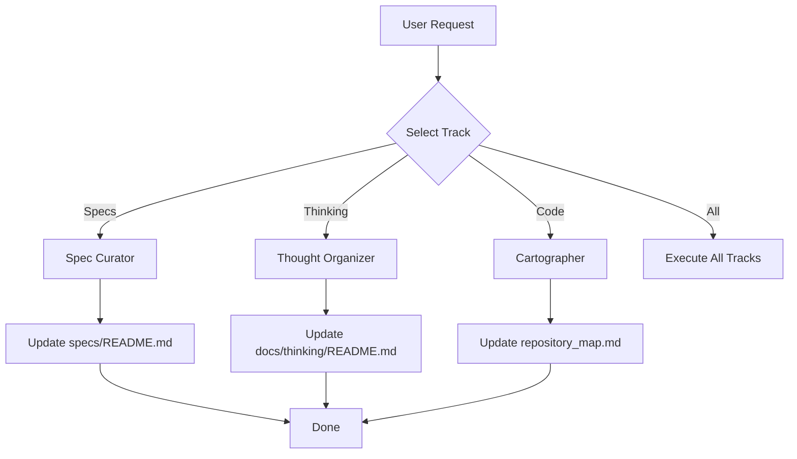

# Librarian Workflow

此工作流指导 Agent 如何扮演图书管理员，执行索引整理任务。

## 流程图



## 步骤清单

### 1. Mode Selection (选择轨道)
询问用户想要整理什么：
*   **[A] Spec Curator**: 整理产品交付物 (`solutions/`)。
*   **[B] Thought Organizer**: 整理思考与会议记录 (`thinking/`)。
*   **[C] Cartographer**: 绘制全仓库地图 (`repository_map.md`)。
*   **[D] All**: 全部执行。

### 2. Execution (执行)
根据选择，加载并执行对应的 Track 文件：
*   Track A: `references/track-spec-curator.md`
*   Track B: `references/track-thought-organizer.md`
*   Track C: `references/track-cartographer.md`

### 3. Report (汇报)
列出已更新的索引文件路径，并简述变更统计（e.g., "Added 3 new specs to index"）。

## 状态管理
```yaml
workflow: maglev-librarian
currentTrack: [Wait for User]
filesUpdated: []
```
