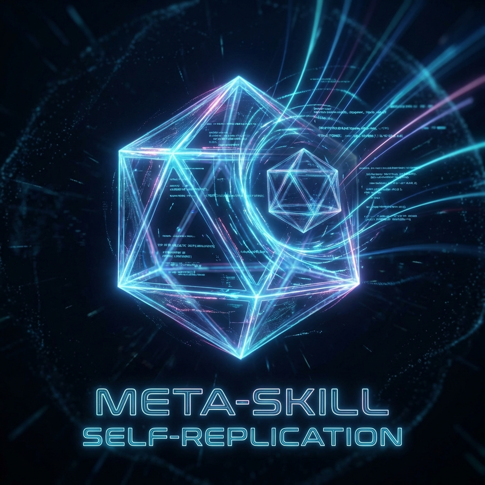

# The Singularity: 当我们开始用 Skill 生成 Skill

> *系统也就是在这个时刻，完成了一次“自我指涉”的进化。*

在项目演进的过程中，我们经历了一个从“手工作坊”到“工业化生产”的有趣质变。今天想分享我们是如何让 AI 学会“自己生孩子”的——即 **Meta-Skill (元技能)** 的诞生故事。

## 1. 史前时代：那个只有 Markdown 的下午

回想项目初期，我和 AI 配合完成了第一个 Skill——`consult_guide`（智能导览）。

那时的场景是这样的：
为了让 AI 能准确回答关于系统复杂架构的问题，我们需要它遵循一套特定的检索规则。我们手写了一个 `SKILL.md`，小心翼翼地定义了 prompt，手动引用了各种文档，还在文件里用自然语言写了一堆 "Do this, don't do that" 的约束。

**痛点非常明显：**
*   **脆弱**：Prompt 稍微写长一点，AI 就容易顾此失彼。
*   **不可复用**：每次想加个新能力（比如“代码审计”），就得把这一大坨 prompt 配置重新拷贝修改一遍。
*   **调试困难**：一旦 AI 不听话，你不知道是哪句话误导了它。

那时候的 Skill 开发，更像是在写一篇复杂的命题作文，既累人又难以标准化。

## 2. 工业革命：Skill Forge 的降临

如果不改变“作坊式”的生产方式，我们的生态就无法扩展。于是我们想：**“既然 Skill 本质上就是一套结构化的文本和指令，为什么不让 AI 帮我们写 Skill 呢？”**

于是，**`skill-forge` (技能熔炉)** 诞生了。

这是一个用来“生产技能”的技能。现在的开发体验完全变了：

> **我**：“我想做一个‘一键初始化环境’的技能。”
>
> **Forge**：“收到。启动 Skill Design 访谈。
> 1. 这个技能叫什么？(e.g. `project-bootstrapper`)
> 2. 它分几步走？(Analyze -> Inject -> Config)
> 3. 它需要读取哪些模板？”
>
> **我**：“叫 project-bootstrapper，分三步，需要 core_rules 模板...”
>
> **Forge**：“明白。正在生成脚手架... Done。”

眨眼之间，一个包含 `doc/workflow/steps` 完整架构的工业级 Skill 就生成好了。

**效果是惊人的：**
*   **标准化**：生成的 Skill 天然具备 "Workflow-Driven Step Architecture"（工作流驱动步骤架构）。每个步骤都被隔离在独立的 Markdown 文件中，Token 占用极低，执行极其精准。
*   **零门槛**：我不再需要关心 `SKILL.md` 的 Frontmatter 格式，也不用担心漏写了 reference 路径。
*   **速度**：过去需要 2 小时调试的 Prompt 逻辑，现在 5 分钟就能生成一个可用的原型。

我就用这个 Forge，在短短十几分钟内开发出了 `project-bootstrapper`，实现了项目初始化的全自动化。

## 3. 盗梦空间：如何构建“制造机器的机器”

最有趣的部分来了：**这个“技能熔炉”本身，是怎么来的？**

这其实是一次“元编程”的实践。我们深入分析了 Starter Kit 中最优秀的几个技能，提炼出了它们的 **DNA**：
1.  **Entry (`SKILL.md`)**: 技能的名片。
2.  **Orchestrator (`workflow.md`)**: 技能的大脑。
3.  **Micro-Steps (`step-*.md`)**: 技能的手脚。

我们将这个 DNA 抽象为模板 (`template_skill.md`, `template_step.md`)，然后编写了一个“元工作流”：
*   **Step 1 Design**: 用访谈提取用户的意图 DNA。
*   **Step 2 Scaffold**: 将 DNA 注入模板，实例化出新的 Skill。

当你运行 `skill-forge` 时，你实际上是在运行一个“能够根据你的意图，自我复制并变异出新形态”的程序。

## 结语

从“手写 Prompt”到“用 Skill 生成 Skill”，这不仅是效率的提升，更是范式的转换。在这个体系下，我们不再是在“写”代码，而是在“设计”能够编写代码的智能体。

这就是 **Meta-Skill** 的魅力。
