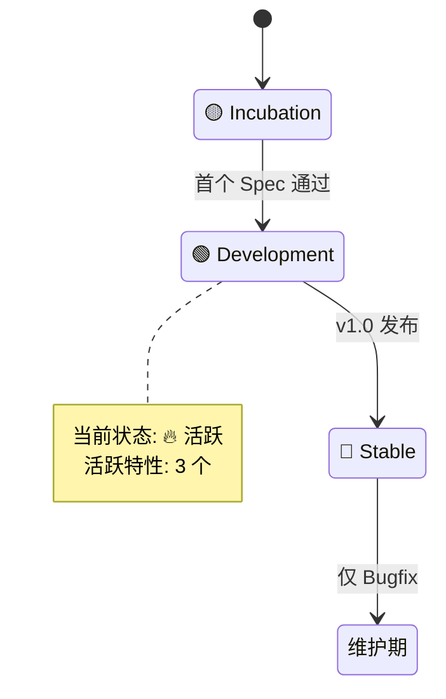
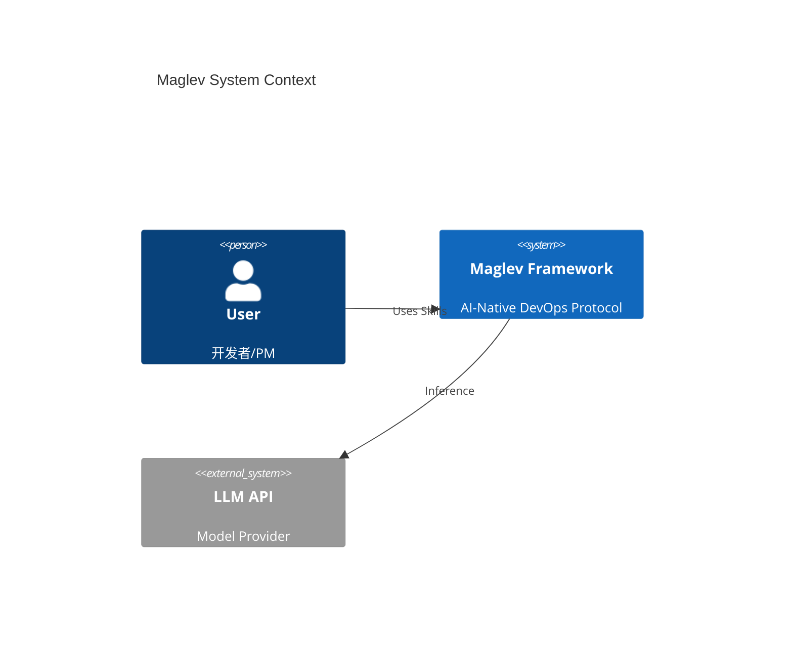

# 🗺️ Maglev Atlas (项目全景地图)

> Last Updated: 2026-02-02 13:58

## 1. 🌍 World Map (战略层)



## 2. 🏔️ Terrain Map (地形层)



## 3. 🏙️ City Map (管线层)

```mermaid
graph LR
    Inbox[📥 意图池 (2)] -->|Ingest| Draft[📄 草稿箱 (1)]
    Draft -->|Crystallize| Active[🏗️ 施工中 (4)]
    Active -->|Dev & QA| Landed[✅ 已落地 (15)]
    
    style Active fill:#f96,stroke:#333
    style Inbox fill:#eee,stroke:#333
```

## 4. 🛣️ Street Map (执行层)


---
*Generated by Maglev Map Maker*
