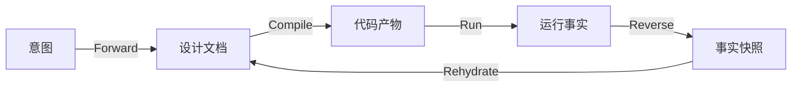

# Maglev 双向上下文与自维护信息协议 (Bidirectional Context Protocol)

> **Created**: 2026-02-09
> **Status**: Draft
> **Intent**: 解决“正向设计”与“逆向事实”的打通问题，以及如何处理系统自维护信息。

---

## 1. 核心问题： Spec 与 Reality 的漂移

在理想世界中，Spec (地图) 永远等于 Code (地形)。但在现实中：
1.  **人为变更**: 开发者可能绕过 AI 直接改了代码 (Hotfix)。
2.  **自维护信息**: 数据库自动生成的 ID、时间戳、第三方服务的实际返回值、Runtime 的性能数据。
3.  **环境差异**: Staging 和 Prod 的配置不同。

如果只做“正向生成”(Forward)，Spec 很快就会过时，变成废纸。
**必须建立“反向吸收”(Reverse) 机制。**

---

## 2. 闭环模型 (The Golden Loop)

Maglev 不再是单向的 `Spec -> Code`，而是一个莫比乌斯环：

### 关键动作：Rehydration (脱水复原/回填)
系统产生的“自维护信息”（如：数据库实际 Schema、API 真实响应），必须作为 **Fact (事实)** 被解析，并**回填**到 Spec 中。

> **例子**：
> 1. **Forward**: Spec 定义 `User` 表有 `id`, `name`。
> 2. **Code**: 生成 SQL `CREATE TABLE...`
> 3. **Reality**: 数据库运行时自动加了 `created_at`, `updated_at`, `is_deleted` (ORM 框架干的)。
> 4. **Reverse**: `maglev-reverse-spec` 扫描 DB 或 Code，发现多了 3 个字段。
> 5. **Rehydrate**: 自动更新 Spec，补上这 3 个字段的定义。

---

## 3. 自维护信息的取舍原则 (Selection Principle)

不是所有运行时的烂摊子都要回填到 Spec 里。我们需要过滤器。

### ✅ 必须回填 (Must-Have)
*   **结构性变化**: 表结构变更、API 契约变更。
*   **业务逻辑修正**: Bug Fix 导致的代码逻辑变化（代表了对业务理解的修正）。
*   **环境约束**: 比如 "Prod 环境只能用 AWS S3" 这种配置约束。

### ❌ 丢弃/仅参考 (Discard)
*   **临时状态**: 具体的 Session ID、临时的调试日志。
*   **噪音**: 格式化风格差异、无意义的注释变更。

---

## 4. 解析策略：从 Log 到 Spec

“自维护信息”如何作为输入？

### A. Static Analysis (静态逆向)
*   **Source**: 代码文件 (Java/TS/Py)。
*   **Tool**: `maglev-reverse-spec`。
*   **Action**: 定期 (如每次 Standup 前) 扫描代码，对比 Spec。如果代码里有 Spec 没提到的 Public Method，**报警或自动补全**。

### B. Dynamic Analysis (动态逆向) - *Advanced*
*   **Source**: 运行日志 (Logs)、数据库元数据 (Information Schema)、API 抓包 (HAR)。
*   **Tool**: `maglev-insight` (概念中)。
*   **Action**:
    > "我发现过去 24 小时 API `/login` 报错 500 次，原因是 `password` 字段太短。-> **建议更新 Spec：密码长度限制改为 8 位。**"

---

## 5. 总结

**不仅要“自顶向下”设计，更要“自底向上”生长。**

*   **正向 (Forward)** 是 **Will (意志)**：我们要世界变成什么样。
*   **逆向 (Reverse)** 是 **Truth (真相)**：世界实际变成了什么样。
*   **Maglev 的智慧**：在于不断缩小 Will 和 Truth 的剪刀差。

**自维护信息不是噪音，它是系统在运行时产生的“新知识”，必须被捕获并沉淀回 Spec (大脑) 中。**
