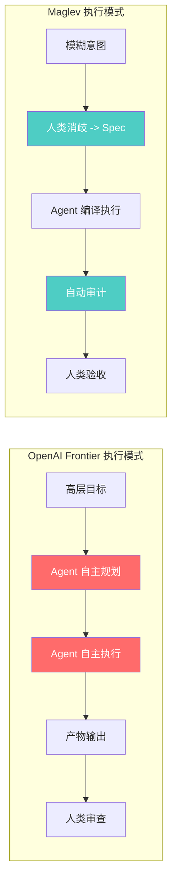
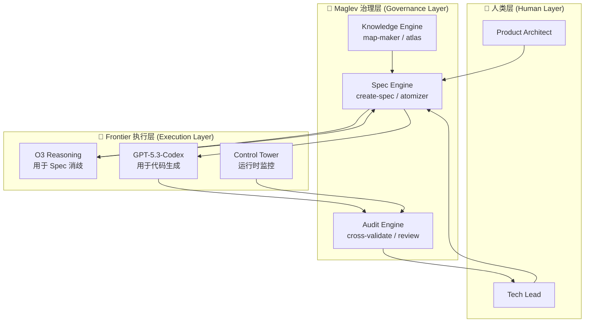

# Maglev vs. OpenAI Frontier: 深度对比与机会点分析

> **Created**: 2026-02-10
> **Updated**: 2026-02-10
> **Context**: OpenAI 于 2026-02-05 正式发布 Frontier 平台与 GPT-5.3-Codex，本文基于公开信息对其与 Maglev 进行多维度深度对比。
> **Status**: Strategic Analysis v2.0

---

## 1. OpenAI Frontier 全景扫描

OpenAI Frontier 并非单一产品，而是一个**三层堆叠的生态组合**：

### 1.1 Frontier Platform — 企业 Agent OS

| 属性 | 详情 |
| :--- | :--- |
| **定位** | 企业级 AI Agent 管理与编排平台，被称为 "Semantic OS" |
| **核心概念** | AI Coworker（数字员工），每个 Agent 拥有独立身份（Employee ID）、权限和边界 |
| **语义层** | 连接 CRM、ERP、数据仓库等异构系统，构建统一的企业语义理解层 |
| **执行环境** | 沙箱化运行时（本地 / 云 / OpenAI 托管），支持代码执行、文件处理、Web 操作 |
| **评估优化** | 内置 Control Tower，实时质量评分与持续反馈优化 |
| **治理** | IAM 级身份管理 + 审计日志 + 合规控制（SOC2 / GDPR） |
| **模型无关性** | 支持 OpenAI、Anthropic、Google 等多供应商模型 |
| **早期客户** | HP、Intuit、Oracle、State Farm、Uber、Cisco、T-Mobile 等 |

### 1.2 GPT-5.3-Codex — 自主编码 Agent

| 属性 | 详情 |
| :--- | :--- |
| **SWE-bench Pro** | 56.8%（公开排行榜第一） |
| **Terminal-Bench 2.0** | 77.3% |
| **OSWorld-Verified** | 64.7%（接近人类平均 72%） |
| **上下文窗口** | 400K tokens，宣称 "Perfect Recall" |
| **速度** | 比 GPT-5.2 快 25% |
| **自我改进** | 参与了自身训练调试、部署管理和评估工具构建 |
| **安全等级** | 首个被分类为 "High Capability" 的网络安全模型 |
| **交互开发** | Codex App 新增 "Guidance" 功能，支持开发中实时交互 |

### 1.3 O3 Reasoning — 推理引擎

- Private Chain of Thought（私有思维链）
- 完整的工具自主权（Tool Autonomy）
- 深度推理 + 多步规划能力

### 1.4 Frontier 的核心哲学

> **"Autonomous Agents"** — AI 像员工一样自主领任务、自主写代码、自主部署，人类只需设定目标。

---

## 2. Maglev 核心哲学回顾

为便于对比，简要回顾 Maglev 的核心理论框架：

### 2.1 Maglev 方程

$$\text{Product}(t) = \int_{0}^{t} \frac{\text{Intent}(t) \times \text{Maglev}}{F(p, t)} \,dt$$

- **Spec 即源代码**：自然语言 Spec 是 SSOT，代码是编译产物
- **摩擦力最小化**：通过缩减团队规模 ($p \to 1$) 消除沟通摩擦
- **精力分配**：$60\%$ Design + $10\%$ Build + $30\%$ Audit

### 2.2 铁三角模型 (Iron Triangle)

$$\text{Triangle} = \text{Product Architect} + \text{Tech Lead} + \text{AI Agent}$$

### 2.3 核心哲学

> **"Spec as Compiler IR"** — 人类负责意图表达与质量审计，AI 负责编译执行，Spec 是两者之间的精确接口。

---

## 3. 多维度深度对比

### 3.1 哲学层：What vs. How

| 维度 | OpenAI Frontier | Maglev |
| :--- | :--- | :--- |
| **核心信仰** | Autonomy First（自主优先） | Governance First（治理优先） |
| **对 AI 的定义** | Digital Coworker（数字同事） | Compiler Backend（编译器后端） |
| **人的角色** | Goal Setter + Supervisor（目标设定者） | Architect + Auditor（架构师 + 审计师） |
| **对"质量"的保证** | 模型能力 + 持续反馈评估 | 结构化 Spec + 对抗性审计 |
| **隐含假设** | AI 足够智能，可以理解模糊意图 | 意图永远需要消歧，模糊 = 风险 |

> [!IMPORTANT]
> **关键洞察**：Frontier 的哲学建立在"模型能力持续增强"的乐观假设上；Maglev 的哲学建立在"人类意图永远不完美"的悲观假设上。**两者不矛盾，而是互补**。

### 3.2 架构层：OS vs. Constitution

| 维度 | OpenAI Frontier | Maglev |
| :--- | :--- | :--- |
| **系统定位** | Agent 的操作系统（部署 + 运行 + 管理） | Agent 的宪法（规范 + 约束 + 审计） |
| **核心组件** | Semantic Layer / Sandbox / Control Tower / IAM | Spec Cluster / Atomizer / Audit Protocol / Atlas |
| **数据治理** | 企业级语义层（连接 CRM/ERP/DW） | Spec-Centric SSOT（Markdown + Mermaid） |
| **Agent 编排** | 多 Agent 可视化工作流（AgentKit） | 单 Agent 深度工作流（Skill + Step） |
| **扩展方式** | 横向扩展：+N Agents | 细胞分裂：+N Iron Triangles |

### 3.3 执行模式层：Black Box vs. White Box



| 属性 | Frontier | Maglev |
| :--- | :--- | :--- |
| **输入精度** | 自然语言目标（可模糊） | 结构化 Spec（强制精确） |
| **过程可见性** | 低（Agent 内部推理不可见） | 高（每步可追溯至 Spec 条目） |
| **纠错时机** | 事后（人类审查产物） | 事中（Audit Protocol 持续拦截） |
| **信任模型** | Trust-then-Verify | Verify-as-you-Go |

### 3.4 治理层：Platform Governance vs. Engineering Governance

| 维度 | Frontier Governance | Maglev Governance |
| :--- | :--- | :--- |
| **治理对象** | Agent 的身份、权限、数据访问 | Agent 的逻辑正确性、意图一致性 |
| **治理粒度** | Agent 级（Who can do what） | Spec 条目级（Is this line correct） |
| **审计类型** | 行为合规审计（Security/Privacy） | 逻辑一致性审计（Intent ↔ Code） |
| **评估机制** | Control Tower（实时质量评分） | Cross-Validate（PRD ↔ Spec ↔ Code ↔ Test） |
| **合规标准** | SOC2 / GDPR / Enterprise IAM | OpenSpec Schema / Accuracy Protocol |

> [!NOTE]
> Frontier 关心"Agent 是否有权做这件事"；Maglev 关心"Agent 做的这件事是否正确"。**两种治理不在同一层**，存在天然的协作空间。

### 3.5 适用场景层

| 场景 | Frontier 表现 | Maglev 表现 | 优势方 |
| :--- | :--- | :--- | :--- |
| **从零开始的新项目** | ⭐⭐⭐⭐⭐ 极强 | ⭐⭐⭐ 中等（需先写 Spec） | Frontier |
| **复杂遗留系统改造** | ⭐⭐ 弱（假设现代化环境） | ⭐⭐⭐⭐⭐ 极强（Map + Reverse-Spec） | **Maglev** |
| **高合规性行业** | ⭐⭐⭐ 中等（IAM + 审计日志） | ⭐⭐⭐⭐⭐ 极强（全链路意图追溯） | **Maglev** |
| **大规模企业通用任务** | ⭐⭐⭐⭐⭐ 极强 | ⭐⭐ 弱（聚焦软件工程） | Frontier |
| **多语言/多技术栈切换** | ⭐⭐⭐ 中等 | ⭐⭐⭐⭐⭐ 极强（Spec 即 IR，Re-compile） | **Maglev** |
| **快速原型验证** | ⭐⭐⭐⭐⭐ 极强 | ⭐⭐ 弱（前期 Spec 成本高） | Frontier |
| **长期系统维护** | ⭐⭐⭐ 中等 | ⭐⭐⭐⭐⭐ 极强（Spec as SSOT） | **Maglev** |

---

## 4. 机会点识别（6 大机会）

### 🔥 Opportunity A: 意图鸿沟（The Intent Gap）

**问题**：Frontier 的 "Autonomous Agent" 依赖用户输入的质量。但企业用户的需求描述往往充满歧义、矛盾和遗漏。OpenAI 的 Guidance 功能试图在执行中修正，但这是**事中补救**而非**事前预防**。

**Maglev 的机会**：**成为 Frontier 的 Spec 供应商**。

```
                   传统流程
用户意图 (模糊) ──────────────────────> Frontier Agent ──> 产物 (可能偏差)

                   Maglev-Enhanced 流程
用户意图 (模糊) ──> Maglev Spec Engine ──> 高保真 Spec ──> Frontier Agent ──> 产物 (高准确)
```

- **行动项**：将 `create-spec` 和 `atomizer` 的输出格式标准化为 Frontier Platform 可消费的格式
- **价值主张**：*"Don't let Frontier guess. Give it a Spec."*

### 🔥 Opportunity B: 信任鸿沟（The Trust Gap）

**问题**：Agent 自主性越高，企业 Tech Lead 的焦虑越大。Frontier 的 Control Tower 提供行为级监控，但缺乏**语义级验证**——它能告诉你 Agent 执行了什么操作，但无法告诉你"这些操作的业务逻辑是否正确"。

**Maglev 的机会**：**成为 Frontier Agent 的 Quality Gate**。

| 验证层级 | Frontier Control Tower | Maglev Audit Protocol |
| :--- | :--- | :--- |
| Agent 是否执行了操作 | ✅ | — |
| 操作是否安全合规 | ✅ | — |
| 代码逻辑是否匹配 Spec | — | ✅ |
| Spec 是否覆盖所有需求 | — | ✅ |
| 新代码是否与存量兼容 | — | ✅ |

- **行动项**：开发 `maglev-frontier-audit` Skill，接收 Frontier Agent 的产出并执行 Cross-Validate
- **价值主张**：*"Frontier tells you what the Agent did. Maglev tells you if it's right."*

### 🔥 Opportunity C: 遗留系统现实（The Legacy Reality）

**问题**：Frontier 假设一个**现代化的、云原生的技术环境**。但全球 80% 的企业代码是遗留系统——单体架构、过时框架、缺失文档。Frontier 的 Agent 在这种环境中会"失明"。

**Maglev 的机会**：**成为 Frontier 入场前的"铺路机"**。


- **行动项**：包装 `map-maker` + `reverse-spec` + `legacy-adopter` 为 "Frontier Ready Program"
- **价值主张**：*"Frontier is the race car. Maglev paves the road."*

### 🔥 Opportunity D: 多 Agent 协调缺口（The Orchestration Specification Gap）

**问题**：Frontier 的 AgentKit 提供了多 Agent 编排的**技术能力**，但没有定义"多个 Agent 之间的业务边界应该在哪里"。当 10 个 Agent 同时修改同一个系统时，谁负责确保它们不会互相冲突？

**Maglev 的机会**：**提供 Agent 协作的 Spec 协议**。

Maglev 的 Constellation 模式（星座模式）天然定义了：
- 每个 Iron Triangle 的职责边界 → 映射为每个 Agent 的工作范围
- Public Specs (API/Schema) 作为协作协议 → 映射为 Agent 间的通信契约
- Core Arch Squad 的全局 Spec → 映射为 Agent 编排的约束条件

- **行动项**：将 Constellation 模式形式化为 "Agent Collaboration Spec Standard"
- **价值主张**：*"Frontier orchestrates Agents. Maglev specifies what each Agent is allowed to own."*

### 🔥 Opportunity E: 评估标准缺口（The Evaluation Standard Gap）

**问题**：Frontier 的 Control Tower 提供"实时质量评分"，但评分标准是**通用的、模型驱动的**。它缺乏针对具体项目的**业务级评估标准**。一个 CRM 系统和一个医疗系统的"质量"定义完全不同。

**Maglev 的机会**：**提供项目级的评估标准定义**。

Maglev 的 Spec Cluster 天然包含：
- `01_requirements.md` → 验收标准（Acceptance Criteria）
- `02_design.md` / `03_backend.md` → 技术约束（Constraints）
- `test-cases/` → 具体测试用例

这些可以被编译为 Frontier Control Tower 的**自定义评估指标**。

- **行动项**：开发 Spec → Frontier Evaluation Rules 的转换器
- **价值主张**：*"Generic quality scores are meaningless. Spec-driven evaluation is specific."*

### 🔥 Opportunity F: 知识资产沉淀缺口（The Knowledge Asset Gap）

**问题**：Frontier Agent 执行任务后，知识散落在 Agent 的执行日志中，难以结构化沉淀。当另一个 Agent 接手同一项目时，需要重新"学习"整个上下文。

**Maglev 的机会**：**提供结构化的知识资产体系**。

| 资产类型 | Frontier 的状态 | Maglev 的状态 |
| :--- | :--- | :--- |
| 项目架构理解 | 散落在 Agent 日志中 | `repository_map.md` + Atlas |
| 业务逻辑文档 | 可能不存在 | `specs/` 目录（完整 Spec Cluster） |
| 决策历史 | 不跟踪 | `docs/thinking/` 决策日志 |
| 变更追溯 | Git 提交记录（碎片化） | Spec 版本 + Contribution Log |

- **行动项**：定义 "Maglev Knowledge Package" 标准，可被 Frontier Semantic Layer 消费
- **价值主张**：*"Agents come and go. Knowledge must stay."*

---

## 5. 融合架构：Maglev on Frontier

### 5.1 架构公式

$$\text{Maglev v3.0} = \text{Maglev Governance Layer} \times \text{OpenAI Frontier Engine}$$

### 5.2 分层架构图



### 5.3 引擎升级路线图

| 阶段 | 改动 | 预期效果 |
| :--- | :--- | :--- |
| **Phase 1: 底层模型升级** | Codex CLI 切换为 GPT-5.3-Codex | 编码速度 +25%，复杂任务成功率提升 |
| **Phase 2: 推理核心升级** | `create-spec` 和 `atomizer` 的思考核心切换为 O3 | Spec 质量提升，消歧能力增强 |
| **Phase 3: 平台集成** | Maglev 作为 "Governance Super-Agent" 部署在 Frontier Platform | 企业级可扩展部署 |
| **Phase 4: 评估桥接** | Spec Cluster → Frontier Evaluation Rules 自动转换 | 项目专属质量评估 |

---

## 6. 竞争态势 SWOT 分析

### Maglev 的 SWOT（相对于 Frontier）

| | 有利 | 不利 |
| :--- | :--- | :--- |
| **内部** | **Strengths** | **Weaknesses** |
| | • 结构化治理体系成熟 | • 社区规模极小（内部项目） |
| | • 遗留系统处理经验丰富 | • 前端生成覆盖率 ~40% |
| | • Spec-as-IR 理论完整 | • 缺乏云原生部署能力 |
| | • 全链路审计协议 | • 无独立的 Agent 运行时 |
| **外部** | **Opportunities** | **Threats** |
| | • Frontier 缺乏意图治理层 | • Frontier 可能自建治理层 |
| | • 企业对 Agent 信任度低 | • GPT-5.3 的 "Guidance" 功能在迭代中可能替代部分 Spec |
| | • 遗留系统改造市场巨大 | • 其他竞品（Anthropic/Google）可能先占位 |
| | • 知识资产管理是蓝海 | • 企业可能选择全 Frontier 栈而非混合方案 |

---

## 7. 战略结论：冷静审视

### 7.1 必须正视的真实威胁

在讨论"机会"之前，必须先诚实地面对 Frontier 对 Maglev 的**存在性威胁**：

**威胁 1：Guidance 功能部分替代了 Spec 的生成阶段消歧**
GPT-5.3-Codex 的 "Guidance" 允许开发者在 Agent 执行过程中实时交互和修正。在**生成阶段**，Guidance 的对话式消歧与 Maglev 的 `create-spec` 交互式生成在用户体验上非常接近——两者都是"人跟 AI 对话来澄清意图"。这意味着在消歧环节，Guidance 确实构成竞争。

但需要注意一个关键区别：**Guidance 的产物是即时的代码修正（无持久化），而 Maglev 的产物是结构化 Spec 文档（持久化知识资产）。** 更重要的是，Guidance **完全没有解决审核阶段的基准问题**——当 Agent 生成了 500 行代码后，人类拿什么来审核？没有 Spec 的 Code Review 本质上是在"凭感觉"。

> **修正后的评估**：Guidance 对 Maglev 在**生成阶段**的威胁是真实的，但 Spec 的核心价值不在于辅助生成，而在于为**人类审核提供基准**。这一点 Guidance 无法替代。

**威胁 2：模型能力飞轮效应**
GPT-5.3 参与了自身的训练调试和部署。这意味着 OpenAI 正在构建一个**自我改进的飞轮**：更强的模型 → 更好的训练工具 → 更强的下一代模型。如果这个飞轮持续转动，模型的"理解模糊意图"能力可能会快速逼近人类水平，使得"意图消歧"这个 Maglev 的核心卖点被**技术性解决**。

**威胁 3：Frontier 可能自建治理层**
OpenAI 已经在 Frontier 中内置了 IAM + Control Tower + 评估优化。这些是治理的**基础设施**。一旦 OpenAI 决定向上延伸——在 Control Tower 中加入业务逻辑验证、在 Semantic Layer 中加入 Spec-like 的结构化知识——Maglev 的差异化空间会被急剧压缩。

**威胁 4：生态锁定**
Frontier 的早期客户是 HP、Oracle、Uber 等巨头。一旦这些企业深度接入 Frontier 生态，引入一个第三方治理层（Maglev）的阻力会非常大——不是因为 Maglev 不好，而是因为**增加系统复杂性的决策在大企业中极难推动**。

### 7.2 Maglev 真正不可替代的内核

剥离掉所有乐观叙事后，Maglev 真正难以被 Frontier 替代的是什么？

核心洞察：**Spec 的首要用户不是 AI，而是审核代码的那个人类（Tech Lead）。**

Frontier Guidance 的审核困境：
```
Frontier 的审核流:
    人脑中的模糊意图  <──对照──>  Code (AI 生成)
    "我觉得...大概...对？"

Maglev 的审核流:
    Spec (结构化业务逻辑)  <──对照──>  Code (AI 生成)
    "Spec 说做 A,B,C -> 代码实现了 A,B,C -> 通过"
    "Spec 说做 A,B,C -> 代码做了 A,B,D -> 不通过"
```

基于此，重新评估可替代性：

| 能力 | Frontier 能否替代 | 分析 |
| :--- | :--- | :--- |
| 生成阶段的意图消歧 | **大部分可替代** | Guidance 的对话式消歧体验接近 `create-spec` |
| 结构化 Spec 编写 | **部分可替代** | 模型越强，自动生成 Spec 的能力越强 |
| 代码审计（行为级） | **部分可替代** | Control Tower 可能扩展到语义级 |
| **审核阶段的审计基准** | **难以替代** :star::star: | 无 Spec 的 Code Review = 在黑暗中摸象 |
| **遗留系统逆向工程** | **难以替代** :star: | 需要深度的领域知识和人工判断 |
| **全链路追溯（Intent -> Spec -> Code -> Test）** | **难以替代** :star: | Frontier 缺乏这个维度的设计 |
| **知识资产结构化沉淀** | **难以替代** :star: | Agent 日志 != 结构化知识 |
| **Iron Triangle 协作模型** | **完全不可替代** :star::star: | 这是方法论，不是技术 |

> [!NOTE]
> **关键发现**：Frontier 的 Guidance 和 Maglev 的 Spec 不在同一个环节竞争。Guidance 解决的是"生成阶段的消歧"，Spec 解决的是"审核阶段的基准"。GPT-5.3 在 SWE-bench Pro 上的准确率只有 56.8%——接近一半的复杂任务会出错——这意味着**审核不是可选项，而是必需品**。没有 Spec 的审核，就像没有考卷答案的阅卷。

### 7.3 三种可能的未来

| 未来 | 概率 | 描述 | Maglev 的命运 |
| :--- | :--- | :--- | :--- |
| **A: 融合共生** | 40% | Frontier 拥抱开放治理生态，Maglev 成为其治理插件 | ✅ 理想结果，但需要 OpenAI 的合作意愿 |
| **B: 被吸收** | 35% | Frontier 自建治理层，吸收 Maglev 的核心思想但不需要 Maglev 本身 | ⚠️ 思想胜利，产品失败 |
| **C: 平行发展** | 25% | Frontier 聚焦通用场景，Maglev 在复杂工程领域保持独立价值 | ✅ 细分市场生存 |

### 7.4 不依赖乐观假设的行动项

基于最悲观的假设（未来 B），Maglev 应该做什么？

| 优先级 | 行动 | 逻辑 |
| :--- | :--- | :--- |
| **P0** | **将 Spec 标准化为开放协议**（不依赖 Maglev 工具链） | 即使产品被替代，标准可以存活（类比 HTTP） |
| **P0** | **深耕遗留系统赛道** | 这是 Frontier 最不擅长的领域，壁垒最高 |
| **P1** | **底层引擎升级至 GPT-5.3 / O3** | 不升级 = 自杀，这是生存必须 |
| **P1** | **发表学术论文，建立理论权威** | 思想影响力是最持久的护城河 |
| **P2** | **开发 Frontier 集成接口** | 拥抱而非对抗，但不能把命运交给 OpenAI |
| **P2** | **构建社区和案例库** | 用实证数据证明 "Spec-driven > Prompt-driven" |

### 7.5 最终判断

**回归根本问题**：

Frontier 与 Maglev 的对比，表面上是"自主 Agent vs 治理框架"，但深层是一个更根本的工程问题：

> **当 AI 生成的代码越来越多、越来越快时，人类审核的瓶颈会成为整个系统的限速器。**

Frontier 在"生成"端做到了极致（SWE-bench Pro 56.8%、400K 上下文、自我改进飞轮），但它**隐含地假设审核可以被弱化**——要么模型好到不需要细审，要么人类可以直接审核代码。这两个假设在简单任务上成立，在复杂企业系统上不成立。

Maglev 的核心价值不在于"帮 AI 理解需求"（这一点 Guidance 确实能做），而在于**为人类审核提供可操作的基准**。Spec 不是 AI 的输入格式，而是 Tech Lead 的审核工具。

**这不是两个赌注在对赌，而是两个不同环节的工具**：
- Frontier 是**生成端**的答案
- Maglev 是**审核端**的答案
- 两者不是非此即彼，而是**先后相继**

> **当前的理性策略**：
> 1. **短期**：拥抱 Frontier 能力（引擎升级至 GPT-5.3 / O3），让 Maglev 的生成质量直接受益
> 2. **中期**：将 Spec 重新定位——不再宣传"Spec 是 AI 的输入"，而是**"Spec 是人类的审核基准"**。这个叙事防御性更强，因为 AI 越自主，审核越重要
> 3. **长期**：将 Maglev 的核心思想（Spec-as-IR、Iron Triangle、Audit Protocol）标准化和学术化，确保即使产品形态演变，方法论仍然存活
>
> **一句话总结**：**AI 越强，审核越重要。Maglev 是审核的基础设施。**
