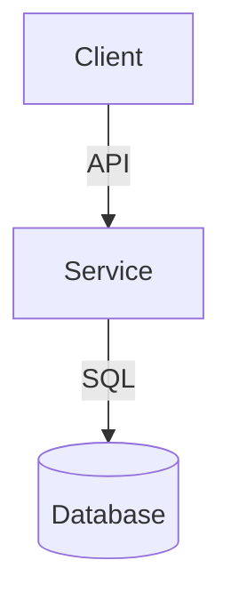

# [{Feature Name}] 技术方案 (Technical Design)

> **Goal**: 定义 "How to Build"。
> **Note to AI**: 根据任务类型 (`ingest_context.meta.type`)，**仅选择性填充**相关的章节。删除不相关的章节。

## 1. 核心架构 (Core Architecture)
> [!TIP]
> 使用 Mermaid 描述数据流或组件关系。



---

## 2. 后端设计 (Backend Design)
> **Scenario**: 涉及 API, DB, 逻辑修改。

### 2.1 数据模型 (Data Schema)
> **Example**:
> ```sql
> ALTER TABLE users ADD COLUMN vip_level INT DEFAULT 0;
> ```

### 2.2 接口定义 (Interface/API)
> **Example**:
> *   `POST /api/v1/orders/create`
>     *   Input: `CreateOrderCmd { skuId, count }`
>     *   Output: `OrderDTO`

### 2.3 核心逻辑 (Core Logic)
> **Example**:
> *   **类名**: `OrderService.java`
> *   **伪代码**:
>     1. 校验库存 (InventoryService)
>     2. 扣减库存
>     3. 创建订单记录
>     4. 发送 MQ 消息

---

## 3. 前端设计 (Frontend Design)
> **Scenario**: 涉及 UI, 组件, 页面交互。

### 3.1 组件树 (Component Tree)
> **Example**:
> *   `Page: OrderDetail`
>     *   `Comp: UserInfoCard` (Props: user)
>     *   `Comp: OrderStatusBadge` (Props: status)

### 3.2 状态管理 (State Management)
> **Example**:
> *   **Store**: `useOrderStore`
> *   **Actions**: `fetchOrder(id)`, `cancelOrder(id)`

### 3.3 交互逻辑 (Interaction Logic)
> **Example**:
> *   **Scenario**: 用户点击“发货”按钮
>     1. 弹出 `ConfirmModal` (二次确认)。
>     2. 点击确认 -> 调用 `shipOrder` API。
>     3. 等待 Loading 状态。
>     4. 成功 -> 关闭 Modal, 刷新列表, 弹出 "Success Toast"。
>     5. 失败 -> 保持 Modal, 显示 Error Message。

---

## 4. 依赖变更 (Dependency Changes)
*   [ ] New Lib: `com.google.guava:guava:31.0`
*   [ ] New Config: `app.payment.enabled=true`
