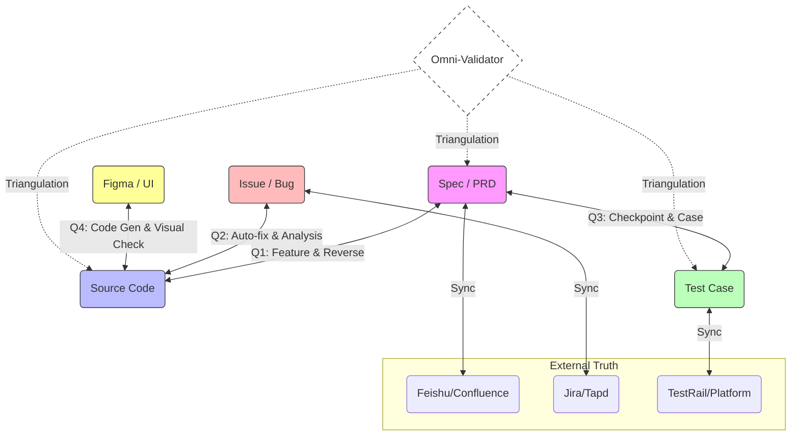

# Efficiency & Cross-Verification Matrix Design

## 1. Context Correction
用户纠正了目标：偏离了纯粹的 QA 视角，转向 **"全流程提效"** 和 **"交叉验证/生成"**。
核心需求是建立资产之间的 **"虫洞" (Wormholes)**，实现任意两个节点之间的双向流动。

## 2. The Efficiency Matrix (资产互通矩阵)

我们需要构建一个网状的技能体系，连接以下四个核心资产：
- **Spec** (需求/PRD)
- **Code** (代码/实现)
- **Bug** (缺陷/Issue)
- **External Platforms** (Feishu/Jira/TestRail)

### Quadrant 1: Spec <-> Code (定义与实现的互通)
- **Forward**: `efficiency.spec_to_code_guide` (Feature Implementation)
    - *User Ask*: 传统的开发。
- **Reverse**: `efficiency.code_to_spec` (Reverse Engineering)
    - *User Ask*: "PRD 的逆向生成"。
    - *Value*: 当代码变了，文档自动跟上；或者把存量代码变成文档。
- **Source**: `efficiency.meeting_to_spec` (Insight Extraction)
    - *User Ask*: "把飞书会议妙记转成 Spec"。
    - *Action*: 提取 Action Items, 过滤废话，结构化为 Markdown。

### Quadrant 2: Bug <-> Code (问题与修复的互通)
- **Forward**: `efficiency.bug_to_fix` (Auto-Fix)
    - *User Ask*: "Bug 描述指导代码修改"。
    - *Action*: 根据 Issue 描述，自动定位代码并生成修复 Patch。
- **Reverse**: `efficiency.code_to_bug_analysis` (Root Cause Analysis)
    - *Value*: 提交代码时，自动分析可能引入的 Bug 风险。

### Quadrant 3: Spec <-> Case (定义与验证的互通)
- **Forward**: `efficiency.spec_to_checkpoints` & `efficiency.spec_to_cases`
    - *User Ask*: "输出为检查点", "生成测试用例"。
    - *Action*: 将自然语言转译为可执行的测试逻辑。
- **Sync**: `efficiency.case_platform_sync`
    - *User Ask*: "测试用例双向同步" (Platform <-> Project)。

### Quadrant 4: Design <-> Code (体验与实现的互通)
- **Forward**: `efficiency.design_to_code` (UI Implementation)
    - *User Ask*: "设计稿转代码"。
    - *Action*: 将 Figma/截图 转化为 Vue/React 组件代码。
- **Verify**: `efficiency.visual_check` (Pixel Perfect)
    - *Action*: 视觉还原度走查 (Code Screenshot vs Design Mockup)。

### Quadrant 5: Omni-Directional (全向交叉验证)
- **Concept**: **Triangulation (三角测量)**。
- **Center**: `efficiency.cross_validator` (The Arbiter)
    - *User Ask*: "需求说A，代码实现了B，但测试用例测的是A'，到底听谁的？"
    - *Action*: 同时读取 `Spec` + `Code` + `Case`。
    - *Logic*: 如果 Spec 和 Case 一致但 Code 不一致 -> Code Bug；如果 Code 和 Case 一致但 Spec 不一致 -> Spec Drift。
    - *Value*: 解决 "资产不一致" 导致的扯皮。

### Layer 6: Universal Platform Sync (平台同步层)
我们不能假设 Local Repo 是唯一真理，必须处理 "Local vs Cloud" 的双向同步：
- **Spec Sync**: `eff.sync_spec` (Repo <-> Feishu/Confluence)
    - *Scenario*: 策划在飞书改了文档，Repo 里的 Markdown 必须自动更新，反之亦然。
- **Bug Sync**: `eff.sync_bug` (Repo <-> Jira/Tapd)
    - *Scenario*: 研发在 Repo 修复了 Issue，Jira 上的单子自动流转状态。
- **Case Sync**: `eff.sync_case` (Repo <-> Test Management)
    - *Scenario*: 用例生成的 xMind/Excel 需要回写到测试平台。

## 3. Revised Roadmap

| Skill ID | Name | Direction | User Intent |
| :--- | :--- | :--- | :--- |
| `eff.extract_checkpoints` | 检查点提取 | Spec -> Checkpoint | 提效 (结构化) |
| `eff.generate_cases` | 用例生成 | Spec -> Case | 提效 (覆盖率) |
| `eff.platform_sync` | 平台同步 | Local <-> Platform | 提效 (一致性) |
| `eff.cross_verify` | 交叉验证 | All <-> All | 质量 (一致性) |
| `eff.bug_pilot` | 缺陷领航员 | Bug -> Code | 提效 (修复指导) |
| `eff.reverse_spec` | 逆向规格 | Code -> Spec | 提效 (文档补全) |

## 4. AI Suggestions (Missing Links)

为了支撑上述矩阵，还需要：
1.  **Context Diff Analyst**: 专门分析不同资产间 "Diff" 的能力。比如 Spec Diff 对应 Code Diff 的哪里？
2.  **Impact Tracer**: (保留之前的建议) 变更影响分析。
