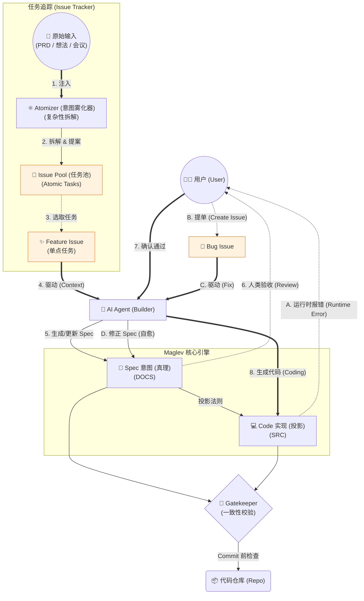
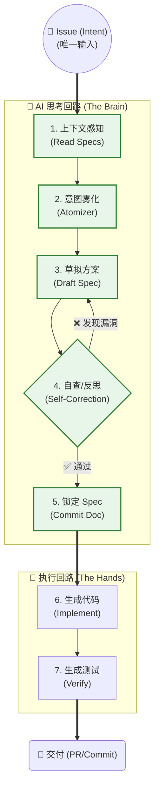
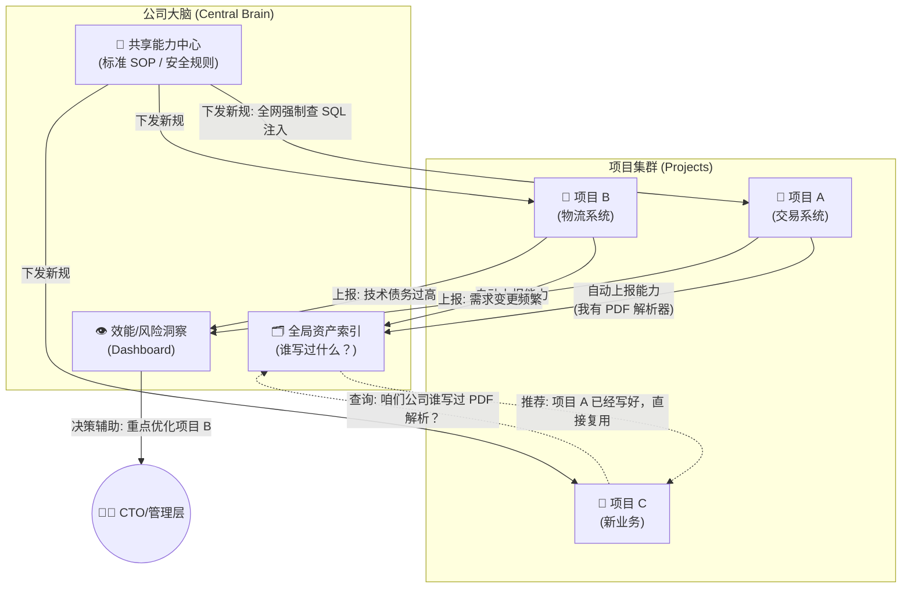

# The Maglev Protocol: AI-Native Collaboration Architecture (Maglev 协议：AI原生协作架构)

> **Core**: Architecture + Contract (架构+契约)
> **Scope**: Project -> Organization -> Strategy

## 0. 定义：Maglev 究竟是什么？(What is Maglev?)

Maglev 不是一个简单的代码模板 (Template)，也不是一个开发框架 (Framework)。
**Maglev 是一套面向 AI Native 时代的"人机协作协议" (Collaboration Protocol)。**

*   **它像 TCP/IP**: 定义了人类意图 (Human Intent) 如何无损地传输给 AI，以及 AI 的执行结果如何被验证。
*   **它像操作系统**: 提供了 Shell (CLI), File System (Spec Structure), Kernel (Agentic Workflow) 来管理日益复杂的软件生产。

### 0.1 核心定位 (Positioning)
*   **不仅仅是工具**: 工具是单向的（人→工具），Maglev 是双向的（人↔AI）。
*   **不仅仅是规范**: 规范是死板的文档，Maglev 是可执行的 Agent 技能。
*   **它是"Co-Pilot+"**: 
    *   Co-Pilot (传统): 你写代码，AI 补全。
    *   Maglev (Co-Pilot+): **你定义意图，AI 完成闭环，平台强制守门。**
    *   📖 **Reference**: [AI Agency Model (代理权模型)](ai_agency_model.md)

## 1. 核心哲学 (Core Philosophy)
Maglev 不是关于"如何写代码"，而是关于**"如何在 AI 时代治理复杂性"**。
*   **Uncertainty (不确定性)**: 承认需求是不确定的，用 AI 的速度 (JIT Rigor) 对抗它。
*   **Anti-fragility (反脆弱)**: 系统应具有自愈能力，多源真理校准。
*   **Transparency (透明度)**: 结构产生透明，透明产生信任（或暴露毒瘤）。

## 1.1 存量系统的救赎 (The Redemption of Legacy)
互联网公司最大的痛点不在于"如何快速写新项目"，而在于**"如何不被旧屎山拖死"**。市面上绝大多数 AI 工具只关注 Greenfield (新项目)，面对 Brownfield (存量项目) 束手无策。

**Maglev 是为"旧城改造"而生的**。它不必推倒重来，而是通过 **"Reverse Engineering" (逆向工程)** 渗透：
1.  **Ingest (摄入)**: AI 扫描旧代码，反向生成 `specs/legacy/`。
2.  **Stabilize (固化)**: 将非结构化的代码逻辑"冻结"为结构化的 Spec 真理。
3.  **Evolve (演进)**: 此后的任何修改，必须先改 Spec。

**价值**: 让拥有十年历史的"屎山"一夜之间拥有了和"新项目"一样的可维护性与自愈力。这是 Maglev 对存量资产的最大敬意。
📖 **Guide**: [Legacy Project Adoption (存量接入指南)](legacy_project_adoption.md)

---

## 2. 架构分层 (Architecture Layers)

### Layer 1: The Project (单项目级)
**目标**: 实现单项目的自治与高效交付。

*   **Engine (引擎)**: `specs/` (Specs Lifecycle).
    *   📖 **Protocol**: [Specs Lifecycle (全生命周期协议)](../starter-kit/.maglev/protocols/specs_lifecycle.md)
    *   **Mechanism**: **Atomizer** (意图雾化). 🔗 [Atomizer Skill](../starter-kit/.agent/skills/atomizer/SKILL.md)
    *   **Logic**: **Spec as IR** (中间码). Spec 是真理，代码只是针对特定技术栈的渲染 (Rendering).
*   **Governance (治理)**: `Code Governance`.
    *   📖 **Rules**: [Core Rules (核心法则)](../starter-kit/.maglev/rules/core_rules.md)
    *   **Law**: The Shadow Rule (代码是 Spec 的影子).
    *   **Check**: **Gatekeeper** (Commit 前的强制校准).
*   **Immunity (免疫)**: Self-Healing.
    *   **Method**: **Triangulation** (Spec vs Code vs Runtime). 只要三者存一，系统即可自愈。 🔗 [Self-Healing Thinking](maglev_self_healing.md)

### Layer 2: The Organization (组织协作级)
**目标**: 打通资产孤岛，实现能力复用。

*   **Network (网络)**: **Global Indexing**.
    *   **Mechanism**: 非侵入式抓取各项目的 `README_INDEX.md`。 🔗 [Index Template](../starter-kit/INDEX.md)
    *   **Value**: **Asset Discovery**. AI 在写代码前先查"全网资产"，杜绝重复建设。
*   **Distribution (分发)**: **Federated Skills**.
    *   **Mechanism**: **Skill-as-a-Service**. 云端升级规则 (e.g. 14-Point Check)，全网同步生效。

### Layer 3: Strategic Insight (组织洞察级)
**目标**: 反向获取组织策略与风险洞察。

*   **Insight (洞察)**: **Reverse Analysis**.
    *   **Method**: 分析 `contribution_log` 和 `debt_register`。
    *   **Value**: **Talent Mapping** (谁是架构师？) & **Risk Heatmap** (哪个业务线在堆屎山？).
*   **Effect (效应)**: **Contrast Agent (造影剂)**.
    *   Maglev 的透明度让 "Toxic Developer" 无处遁形，实现了组织的自我净化。

---

## 3. 核心机制关系图 (Mechanism Topology)

### 3.1 核心机制：单项目全生命周期 (Project Full Lifecycle)

此图展示了从"需求/Bug"到"落地/修复"的完整闭环。它明确了 **Issue (任务)**、**Spec (意图)** 和 **Code (实现)** 之间的三角流转关系。

> **🔑 什么是守门人 (Gatekeeper)?**
> 它可以理解为代码仓库的**"安检员"**。在代码提交 (Commit) 之前，它会强制比对 **Spec (意图)** 和 **Code (实现)**。
> *   如果你改了代码，却没改文档 -> **❌ 拦截**。
> *   如果你改了文档，还没写代码 -> **❌ 拦截**。
> *   只有两者**完全对齐**，才放行进入仓库。这确保了"文档永远是活的"。

### 3.2 协作助理内核：AI 思考回路 (The AI Brain)

此图进一步放大"AI 协作助理"内部，展示它在接受到一个指令后，具体是如何思考和执行的。它不是在"乱写"，而是在遵循严格的**协议 (Protocol)**。

### 3.3 核心机制：组织级生态网 (Organizational Ecosystem)

此图展示了当有 100 个项目时，Maglev 如何让它们变成一个整体，实现"一方改进，八方受益"。

## 4. 结论 (Verdict)

Maglev 的诞生，标志着软件工程从 **"手工业时代" (Craftsmanship)** 向 **"工业化时代" (Industrialization)** 的彻底转型。

*   **过去 (Pre-AI)**: 代码是资产，也是负债。我们小心翼翼地维护着每一行代码，生怕它崩塌。
*   **未来 (Post-AI)**: **Spec (意图) 才是唯一的资产**。代码只是根据当前技术栈（Java/Vue/Python）实时渲染的"廉价消耗品"。

Maglev 不是要取代开发者，而是要**解放**开发者。
它剥离了重复低效的"编码"（Implementation），保留了最具价值的"思考"（Thinking）与"决断"（Decision）。

**最终，Maglev 只做一件事：**
让你的组织在 AI 的洪流中，依然能保持 **"清醒的头脑" (Clear Intent)** 和 **"强健的体魄" (Robust Code)**。

**Code is ephemeral. Intent is eternal.**
(代码终将朽坏，唯有意图永存。)

## 5. 附录：人机协作参与度矩阵 (Participation Matrix)

为了消除"Maglev 是否全是 AI 在瞎编"的疑虑，我们定义了各环节的责任权重。

| 环节 (Phase) | 核心产物 (Artifact) | 👨‍💻 人类 (Human) | 🤖 智能体 (AI) | 🏗 平台 (如Git、luban) | 谁负主责 (Main Driver) |
| :--- | :--- | :--- | :--- | :--- | :--- |
| **1. 意图定义** | Issue / Spec | **60%** (口述/把关) | 40% (草拟/润色) | 0% | **Human** (意图即指令) |
| **2. 技术设计** | Tech Design | 30% (架构决策) | **70%** (方案填充) | 0% | **Mixed** (人定骨架，AI填肉) |
| **3. 代码实现** | Source Code | 10% (Code Review) | **90%** (生成) | 0% | **AI** (高效执行者) |
| **4. 质量验证** | Tests / CI | 20% (验收测试) | **50%** (生成用例) | **30%** (自动化执行) | **Platform** (客观公正) |
| **5. 治理守门** | Gatekeeper | 0% (被动遵守) | 20% (预检) | **80%** (强制拦截) | **Platform** (铁面无私) |

> **解读**: Maglev 的设计让 AI 在"搬砖"环节（Coding）发挥最大能量，但在"决策"（Spec）和"合规"（Gatekeeper）环节，权柄依然在人类和平台公理手中。这一设计从根本上规避了 AI 幻觉带来的失控风险。

## 6. 附录 B：效能演进对比 (Efficiency Evolution)

为了更直观地理解 Maglev 的价值，我们将 **"传统开发"**、**"AI 辅助 (Copilot)"** 与 **"Maglev 范式"** 在时间投入上进行对比。

### 1. 时间消耗分布 (Time Distribution: From Maker to Auditor)

Maglev 带来的最大变化不仅仅是快，而是**角色的根本性反转**。人类从"写代码的工匠"变成了"验收代码的检察官"。
请注意：**虽然编码时间归零了，但审核（Review）的认知负担大幅增加了。**

| 环节 | 传统模式 (Legacy) | Copilot 模式 (Ad-hoc) | Maglev 范式 (Protocol) | 核心变化分析 |
| :--- | :--- | :--- | :--- | :--- |
| **思考与定义** (Thinking) | 20% | 15% | **50%** | **反思的代价**: 你必须想得非常清楚，因为 AI 会忠实地放大你的每一个逻辑漏洞。 |
| **编码生产** (Coding) | 50% | 30% | **5%** | **算力替代**: 这一行彻底外包。 |
| **调试排错** (Debug) | 30% | 40% | **10%** | **自愈**: 依靠三角验证快速定位，减少无效排查。 |
| **审核验收** (Auditing) | 0% (自己写的默认信) | 15% | **35%** | **信任重构**: 你不再信任代码（因为它不是你写的），你必须逐行核对 Spec 与 Code 的一致性。这是一项繁重的脑力劳动。 |

> **💡 警示**: 不要以为 Maglev 让你变懒了。相反，它要求你**更清醒**。
> 以前你写代码时可以"凭感觉"，现在你审核 AI 代码时必须"讲逻辑"。这种**从生产 (Production) 到审核 (Audit) 的重心转移**，是使用 Maglev 必须做好的心理准备。

### 2. 场景化提效预估 (Scenario Gains)

> [!IMPORTANT] **关于提效倍率的特别说明 (Disclaimer on Efficiency Gains)**
> 上表的"提效倍率"是基于**理想状态 (Ideal State)** 下的测算，即：**上下文完备 + 意图清晰 + 基建成熟**。
>
> 在 **冷启动期** 或 **探索性业务** 中，由于需要"边开飞机边换引擎"（补充 Spec/Rule），初期效率可能会**持平甚至下降**。
> **管理者请勿机械地将此倍率作为 KPI 考核指标**。如果以此压榨执行层，必然导致团队为了达标而绕过 Spec 治理，陷入"为了快而牺牲质量"的**对抗旋涡 (Confrontation Vortex)**，最终导致 Maglev 体系崩塌。

| 场景 | 传统模式 | Copilot 模式 | Maglev 范式 | 提效倍率 (Est.) | 核心差异点 |
| :--- | :--- | :--- | :--- | :--- | :--- |
| **🟢 新功能开发** (Green Flow) | 5天 | 3天 (少写代码) | **0.5天** | **~10x** | **One-Shot**: 从语意直接到可运行代码，跳过手动组装。 |
| **🔴 缺陷修复** (Red Flow) | 4小时 | 2小时 (AI 先解释) | **10分钟** | **~24x** | **Self-Healing**: 自动定位 -> 自动反推 Spec -> 自动修复。 |
| **🚜 遗留重构** (Legacy) | 不敢动 | 敢动点 | **降维打击** | **Infinity** | **Reverse Eng**: Maglev 能先将代码逆向为 Spec，建立基准后再重构。 |

> **结论**: Maglev 带来的不是线性的效率提升 (10% -> 20%)，而是**维度的转换**。它将开发者的角色从 **"搬砖工 (Worker)"** 升级为 **"建筑师 (Architect)"**——你花更多时间画图纸（Spec）和验收（CR），而将砌墙的工作彻底外包。

## 7. 附录 C：常见问题 (FAQ)

本章节汇总了关于 Maglev 范式的核心疑问与反思。

### Q1: Maglev 只是一个高级的代码模板 (Template) 吗？
**No.** 模板是静态的文件，Maglev 是动态的**协议 (Protocol)**。
*   模板给你一个 `Controller.java` 让你填空。
*   Maglev 定义了 `Issue -> Spec -> Code` 的**数据流向**，并提供了 `Atomizer` (拆解) 和 `Gatekeeper` (校验) 等**主动技能**来维护这个流向。它是活的操作系统，而不是死的脚手架。
📖 **Deep Dive**: [Specs Lifecycle Protocol (全生命周期协议)](../starter-kit/.maglev/protocols/specs_lifecycle.md)

### Q2: 既然代码都是 AI 写的，我岂不是可以"躺平"了？
**恰恰相反。** Maglev 实际上**增加了**你的认知负荷。
*   在传统模式下，你可以写出"虽然丑但能跑"的代码。
*   在 Maglev 模式下，你是 **Spec 的定义者**和 **Code 的审核员**。你必须想得非常清楚（定义逻辑边界），并拥有极高的鉴赏力（审核 AI 产物）。
*   Maglev 让"体力劳动"归零，但对"脑力劳动"提出了更高要求。它淘汰的是"搬砖工"，奖励的是"架构师"。
📖 **Deep Dive**: [Efficiency Matrix Design (效率矩阵)](efficiency_matrix_design.md)

### Q3: Maglev 只能用于 B 端 (B2B) 业务吗？
**No.** Maglev 适用于任何**追求工程严谨性**的领域。
*   它的核心是 "Spec-First" 和 "Gatekeeper 治理"。
*   无论是中间件开发、嵌入式系统，还是复杂的 C 端后端，只要需要**多人协作**和**长期维护**，Maglev 都是最佳解。
*   例外：纯粹的一次性创意 Demo 或艺术类项目（追求无序与灵感）可能不适合。
📖 **Deep Dive**: [Universality Analysis (普适性分析)](maglev_universality_analysis.md)

### Q4: 我的项目已经是"屎山"了，还能用 Maglev 吗？
**Yes. 这正是 Maglev 的强项。**
*   Maglev 提供了 **"Reverse Engineering" (逆向工程)** 路径。
*   不要试图重写屎山。让 AI 扫描旧代码，反向生成 `specs/legacy/`，先建立"法理依据"。
*   之后的新需求，必须遵循 Maglev 流程。这样你就可以"冻结"旧债务，开启新秩序。
📖 **Deep Dive**: [Legacy Project Adoption (存量接入指南)](legacy_project_adoption.md)

### Q5: 如果 AI 产生幻觉 (Hallucination) 怎么办？
**Maglev 的架构就是为了对抗幻觉而生的。**
*   **Triangulation (三角验证)**: Spec (意图) vs Code (实现) vs Test (验证)。三者互相制约，AI 很难同时在三个地方撒同一个谎。
*   **Gatekeeper (守门人)**: 这是硬逻辑检查。如果 AI 生成的代码无法溯源到 Spec，或者无法通过 Lint/Test，会被 Git 钩子无情拦截。
*   **Human Loop (人机共生)**: 最终的 `git push` 权限永远在人类手中。你拥有最终的一票否决权。
📖 **Deep Dive**: [Self-Healing Thinking (自愈机制)](maglev_self_healing.md)

### Q6: Maglev 会不会变成"看起来很美但无法落地"的 Paperwork？
**不会。因为它把"对自律的要求"变成了"对智力的奖赏"。**

*   **传统方法的痛点**: 它们要求的是 **"道德自律" (Moral Discipline)** —— "以此为荣，不仅要写代码，还要写文档，还要维护一致性..." —— 这反人性，所以很难落地。
*   **Maglev 的爽点**: 它要求的是 **"智力自律" (Intellectual Discipline)** —— "只要你能把意图描述清楚，剩下的脏活累活（写代码、同步文档、检查合规）我都帮你干了。"
📖 **Deep Dive**: [Core Rules (核心法则)](../starter-kit/.maglev/rules/core_rules.md)

**这是一种身份的转换**:
当你发现能轻松驾驭 Maglev 时，不是因为你变勤奋了，而是因为**你的段位到了**。你已经具备了"用自然语言精准定义系统"的架构师能力。这是一种**降维打击**般的轻松感。

### Q7: Maglev 协议必须侵入我的仓库代码吗？
**取决于项目阶段 (Phase-Dependent Integration)。**
*   **Greenfield (新项目)**: 建议 **In-Repo**。直接初始化标准目录结构，享受原生支持。
*   **Brownfield (老项目)**: 建议 **Sidecar (工作站模式)**。Maglev 作为一个独立的 `.maglev/` 目录挂载在项目根路径下，或者作为独立的 "Governance Repo" 存在。它只读取代码生成 Spec，不污染业务逻辑。
📖 **Deep Dive**: [Project Startup Manuals (项目启动手册)](project_startup_manuals.md)

### Q8: 对团队配置有什么要求？
Maglev 实际上降低了对"全栈工程师"的需求，但提高了对 **"关键角色"** 的要求。
*   **必备三角 (Iron Triangle)**:
    1.  **Value Owner (产品定义)**: 必须能清晰描述"要什么"，而不是"怎么做"。
    2.  **Tech Pilot (架构领航)**: 必须能审核 AI 生成的代码质量，判断是否存在安全隐患。
*   **不再需要**: 纯粹的"切图仔"或"CRUD 熟练工"。这些工作已全权委托给 AI Agent。
*   **一句话**: 团队人数可以减少，但平均段位（尤其是定义能力和鉴赏能力）必须提高。
📖 **Deep Dive**: [Role Models Analysis (角色模型分析)](role_models_analysis.md)

### Q9: 遇到"水土不服"怎么办？(e.g. AI 不懂内部组件库 / 代码风格不一致 / 防止幻觉)
**这通常不是能力瓶颈，而是"上下文供给"问题。**
Maglev 重新定义了你的职责：**你不再是"代码搬运工 (Worker)"，你是"体系创造者 (Creator)"。**

*   **AI "不懂" 或 "不乖"? -> 创造 "Rules & Skills" (全域赋能)**
    *   无论是 AI 不认识内部组件 (Lack of Context)，还是代码风格不合口味 (Misalignment)，本质上都是**规则与能力的缺失**。
    *   **解法**: 不要仅是在当前对话中纠正它。去创造 **Rules** (`.maglev/rules/`), 编写 **Skills** (`.agent/skills/`), 或配置 **MCP Server**。
    *   **价值**: 
        *   **上帝视角 (God Mode)**: 你是在为 AI 制定法律和赋予能力。
        *   **杠杆效应**: 你编写了一个 Skill，全团队的 AI Agent 瞬间学会。这种**"教会徒弟，解放全军"**的成就感，是传统编码无法比拟的。
    *   📖 **Deep Dive**: [AI Native Config Templates (配置模板)](ai_native_config_templates.md)
*   **私有/复杂逻辑? -> "混合双打" (Hybrid Mode)**
    *   Maglev 并不禁止人类写代码。对于极度敏感的核心算法，你可以亲手打造。
    *   **但请记住**: 必须遵守 **"Shadow Rule"** —— 即代码写完后，必须反向补充 Spec。
    *   **价值**: 将你的智慧结晶"固化"为 Spec，防止它随人员流动而失传。这是对组织资产的终极保护。

### Q10: Maglev, Spec-Kit, OpenSpec 到底有什么区别？
**这是一个关于"引擎 (Engine)"、"燃料标准 (Fuel)"与"整车 (Vehicle)"的区别。**

| 概念 | 类比 | 核心公式 | 定义 | 适用场景 |
| :--- | :--- | :--- | :--- | :--- |
| **Spec-Kit / SDD** | **引擎 (Engine)** | `Code = AI(Spec)` | **技术范式**。强调"先写文档后生成"。 | 独立开发者 (Indie Hacker)，单兵作战。 |
| **OpenSpec** | **燃料标准 (Fuel)** | `Spec = Protocol` | **交互协议**。定义了 Prompt 的标准结构，确保生成的确定性。 | 需要精准控制 AI 输出的场景。 |
| **Maglev** | **整车 (Vehicle)** | `Value = Role + Engine + Governance` | **操作系统**。它不仅包含引擎，还定义了谁来踩油门 (Role)、交通规则 (Governance) 和仪表盘 (Inight)。 | **B2B 团队**，需要解决协作、规模化和存量治理问题。 |

**结论**:
*   Maglev 是一辆跑车，它**内置了** SDD 引擎，并**兼容** OpenSpec 标准燃料。
*   如果你只需要一个引擎，用 Spec-Kit；如果你需要建立一套交通网，用 Maglev。
📖 **Deep Dive**: [Maglev vs SDD (模式对比)](maglev_vs_sdd.md) | [Maglev vs OpenSpec (协议对比)](maglev_vs_openspec.md)

### Q11: Maglev vs BMAD: 谁才是 AI 敏捷开发的未来？
**这是一个关于"操作系统 (OS)"与"敏捷教练 (Coach)"的区别。**

| 维度 | BMAD (Agile Team Simulation) | Maglev (AI-Native OS) |
| :--- | :--- | :--- |
| **隐喻** | **外包团队 (Agency)** | **操作系统 (Operating System)** |
| **核心** | **Process (流程)**. 模拟 PM/Dev 角色对话，跑 Sprints。 | **Truth (状态)**. 维护 Spec/Code 一致性，强制审计。 |
| **适用** | **Greenfield / Solo / Fast Prototype**. | **Brownfield / Team / Long-term Eng**. |

**结论**:
*   如果你需要一个"陪练"帮你通过对话梳理需求，**用 BMAD**。
*   如果你需要一个"基建"帮你治理代码质量和技术债，**用 Maglev**。
*   **融合**: 你完全可以在 Maglev 的 `issues/` 目录下运行 BMAD 的 Sprint 流程，但产出必须固化为 Maglev 的 Spec。
📖 **Deep Dive**: [Maglev vs BMAD (范式对比)](maglev_vs_bmad.md)

### Q12: 为什么 Maglev 不内置海量的编程 Skill (如 Java专家/Vue大师)?
**因为我们想把"创造的成就感"留给你。**

Maglev 的哲学是 **"Microkernel" (微内核)**，而不是 **"Monolith" (全家桶)**。
*   **Maglev 负责 (Kernel)**: 核心的 **Governance Skills** (e.g. Audit, Gatekeeper, Atomizer)。这是为了保证系统运转的秩序。
*   **你负责 (User Space)**: 具体的 **Domain Skills**。
    *   没人比你更懂你们公司的业务逻辑或技术偏好。
    *   **激励机制**: 如果 Maglev 把所有事都干了，开发者会觉得自己是无用的。但如果开发者亲手编写了一个 "MyCompany Java Expert" Skill 并分享给全团队，**他是英雄**。
    *   **生态复用**: 市面上已经有大量优秀的 Prompt/MCP (e.g. LangChain, Awesome-Prompts)，Maglev 做好连接器即可，无需重复造轮子。
**Maglev Provide the Stage, You perform the Play.**
