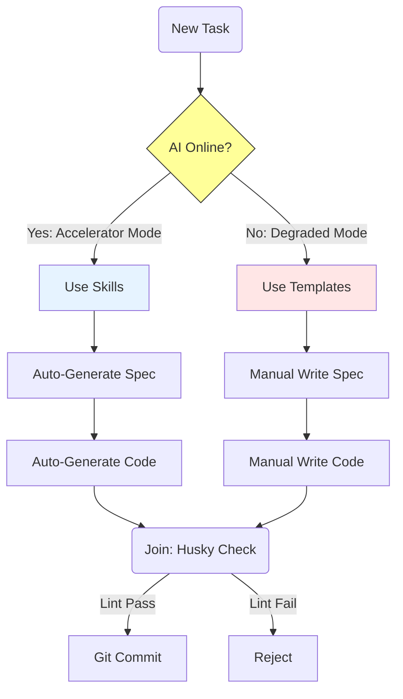

# 业务连续性计划：断电模式 (Business Continuity Plan: Off-Grid Mode)

## 1. 核心风险识别 (Why we need this?)
用户指出了 Maglev 体系的致命单点故障 (SPOF)：
- **Risk A (Availability)**: 网络中断或 AI API 宕机，开发流瘫痪。
- **Risk B (Consistency)**: 张三用 Cursor，李四用 ChatGPT 网页版，产出物格式不统一，无法利用工具链。

## 2. 核心原则：AI 是加速器，不是发动机
**Maglev 的本体是“方法论”，AI 只是将其速度提升了 10 倍。**
当 AI 缺位时，我们应能自动切换到 **"降级模式 (Degraded Mode)"**，虽然速度变慢 (1x)，但方向不变，质量不降。

---

## 3. 应对策略 A: "断电"执行 SOP (Availability)

### 3.1 意图定义 (Spec Writing)
- **AI Mode**: 人类口述 "我要做登录"，AI 生成详细 Spec。
- **Manual Mode**: 
  - 人类直接复制 `templates/spec_template.md`。
  - 手工填写 `## User Stories`, `## API Design`。
  - **关键点**: **不降级文档标准**。即使手写，也要写满核心字段。

### 3.2 代码构建 (Coding)
- **AI Mode**: AI 根据 Spec 生成代码。
- **Manual Mode**: 
  - 人类阅读 `specs/` 目录下的 Spec。
  - 手写代码 (Old School Way)。
  - **关键点**: **Spec First 原则不变**。不许跳过 Spec 直接写代码，否则后续 AI 上线后无法交叉验证。

### 3.3 质量验收 (Verification)
- **AI Mode**: 自动生成 Test Case，自动 Review。
- **Manual Mode**:
  - 人工编写 JUnit/Jest 测试用例。
  - 人工执行 Code Review (对照 Spec 逐行看)。
  - **关键点**: **Checklist 强制执行**。必须对照 `standards/archival_checklist.md` 人肉打钩。

---

## 4. 应对策略 B: 消除"工具参差" (Consistency)

不管你是用 Cursor, Copilot, 还是 Notepad，**产出物必须标准化**。这是解决工具碎片化的唯一解。

### 4.1 Interface over Tool (接口优于工具)
我们不限制工具，但严格限制 **“交付接口”**：
- **Specs**: 必须是 Markdown，必须包含 Frontmatter (YAML头)。
- **Issues**: 必须遵循 `templates/issue_templates/` 结构。
- **Commits**: 必须遵循 `feat:`, `fix:` 语义化规范。

### 4.2 The "Linting as Guard" (工具兜底)
引入 **Husky / Pre-commit Hooks** 作为仅仅依靠机器（非AI）的最后防线：
- **Lint Check**: 只要格式不对 (e.g. Spec 缺了 Author 字段)，Git Commit直接拒绝。
- 这迫使所有工具（包括想要偷懒的人类）必须输出符合标准的内容。

---

## 5. 演练计划 (Fire Drill)
建议每个迭代安排半天 **"No AI Day"**：
- 拔掉 Copilot 插件。
- 仅靠 `solutions/` 文档和 `templates/` 模板进行开发。
- **目的**: 验证文档的完整性。如果离了 AI 你看不懂文档，说明文档写得不合格。

---
> **结论**: 伟大的流水线即便停电了，工人也能手摇传输带继续生产。Maglev 的文档体系就是那条“传输带”。
