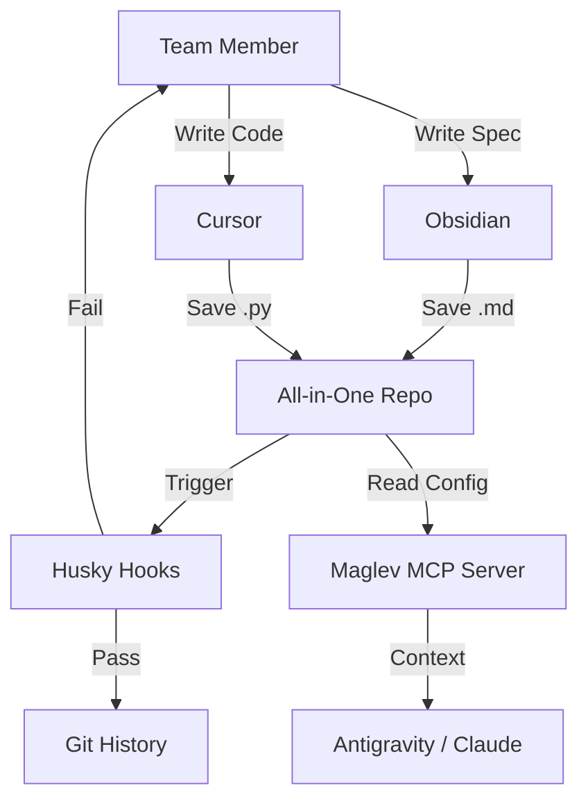

# Maglev 极简工具链 (Minimalist Toolchain)

为了支撑 Maglev 体系的高效运转，我们精选了一套 **"Low Entropy, High Leverage" (低熵高杠杆)** 的工具组合。
选型原则：**可靠 (Reliable)**、**先进 (Advanced)**、**开放 (Open)**。

## 1. 选型逻辑与及验证 (Selection Logic & Verification)

### 1.1 编辑器: Obsidian (Product) + VS Code/Cursor (Dev)
- **Why Obsidian?**
    - **现状验证**: 2025年，Obsidian 已成为企业级知识管理的首选（被 Google, Amazon 等采用）。其 "Local First" 架构完美契合 Maglev 的 "All-in-One Repo" 策略。
    - **先进性**: 新增的 "Canvas" (无限画布) 和 "Bases" (数据库视图) 极大降低了 VO 编写结构化 Spec 的门槛。
    - **可靠性**: 纯 Markdown 存储，无 Vendor Lock-in，即使 Obsidian 倒闭，数据依然可用。

### 1.2 协作契约: Husky (Governance)
- **Why Husky?**
    - **现状验证**: 截止 2025年，Husky (v9.x) 被超过 150 万个 GitHub 项目使用，是 Git Hooks 管理的工业标准。
    - **可靠性**: 它足够轻量（zero dependency），只做一件事：确保 Git 流程合规。
    - **用途**: 强制执行 "Commit 必须关联 Issue"、"修改代码必须有 Spec 变更" 等 Maglev 铁律。

### 1.3 AI 连接器: Model Context Protocol (Context)
- **Why MCP?**
    - **现状验证**: 2025年被称为 "Year of AI Agents"。MCP 是由 Anthropic 和 Google 共同推动的开放标准。
    - **先进性**: 它解决了 "AI 不懂项目规则" 的痛点。通过部署轻量级 MCP Server，我们可以让 Cursor, Antigravity, Claude Desktop 同时读取 `.maglev/` 下的规则。
    - **开放性**: 避免绑定单一 AI 厂商。

---

## 2. 架构概览 (Architecture)

## 3. 开放集成策略 (Open Integration)

针对企业现有系统（Jira, Wiki），我们采取 **"Local First, Async Mirroring"** 策略。

### 3.1 本地优先 (Local First)
- 开发团队坚持在本地文件系统闭环。
- **Source of Truth**: 本地仓库中的 `/specs` 和 `/issues`。

### 3.2 异步镜像 (Async Mirroring)
- **Adapter**: 编写简单的 Python 脚本或 MCP Tool。
- **Direction**:
    - `Sync-Down`: 定时将 Jira 中的新 Story 拉取为 `/specs/stories/*.md`。
    - `Sync-Up`: Git Push 时，通过 Hook 触发 API 调用，更新 Jira 状态。
- **Benefit**: 既享受了本地开发的极速体验，又满足了企业的审计合规需求。

---

## 4. 实施建议
- **Day 1**: 全员安装 Obsidian，配置 Git 插件。
- **Day 3**: 部署 Husky，拦截不合规 Commit。
- **Day 7**: (可选) 部署 MCP Server，接入 AI 助手。
