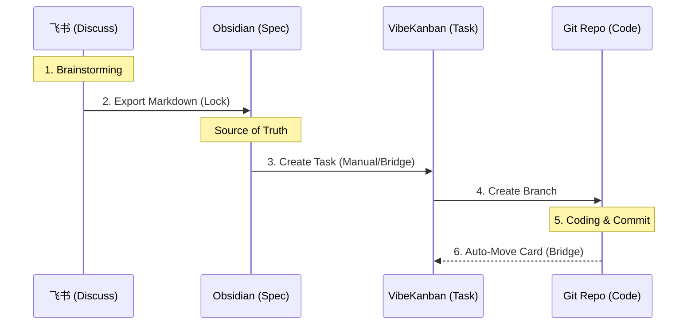

# 工具链对抗分析 (Toolchain Adversarial Analysis)

本文档记录了关于 Maglev 工具链选型的理性辩论。
**目标**: 通过对抗式分析 (Red Teaming)，消除个人偏好，找到最适合团队现状的“局部最优解”。

## 1. 核心争议点 (The Core Conflicts)

| 维度 | 我的初选 (Blue Team) | 你的挑战 (Red Team) | 核心冲突 (Conflict) |
| :--- | :--- | :--- | :--- |
| **Orchestration** | 纯 Git + Markdown | **VibeKanban** / Worktrunk | **Pure vs Tooling**: 纯文本流转 vs 专用 GUI 编排。 |
| **Spec Editor** | Obsidian (Local) | **Feishu Docs** (Cloud) | **Local vs Cloud**: 代码同源 (Spec-as-Code) vs 团队习惯 (Collaboration)。 |
| **Governance** | Husky (Git Hooks) | **Agent Skills** | **Mandatory vs Voluntary**: 强制拦截 vs 智能引导。 |
| **Connectivity** | MCP Server | **Claude Skills** (Prompt-based) | **Standard vs Native**: 工业标准协议 vs 低门槛原生技能。 |

---

## 2. 深度辩论 (Deep Dive)

### Round 1: 怎么管任务? (VibeKanban vs Git Flow)
- **Red (You)**: VibeKanban 提供了 Worktree 隔离和可视化的看板，这正是 Maglev "Ring Iteration" 的完美具象化。为什么不要？
- **Blue (Me)**: 引入新平台会增加维护成本。
- **Rebuttal (Synthesis)**:
    - **你是对的**。Maglev 的并行迭代如果只靠命令行 (Worktrunk) 或纯 Git，认知负担太重。
    - **VibeKanban** 是一个极佳的 **"Maglev Dashboard 载体"**。它天然支持 "AI Agent 隔离执行" 和 "Human Review"，这直接通过工具固化了 Maglev 的流程。
    - **结论**: **采纳 VibeKanban** 作为核心编排器。

### Round 2: 在哪写文档? (Obsidian vs Feishu)
- **Red (You)**: 团队都在用飞书。强推 Obsidian 会导致“文档孤岛”，没人会在两个地方维护文档。
- **Blue (Me)**: 但 AI 读不到飞书的实时类容（除非写复杂的 API 插件），且飞书文档不在 Git 版本控制中，无法做到 "Code & Spec Sync"。
- **Rebuttal (Synthesis)**:
    - 这是一个**“协作便利性” vs “工程严谨性”** 的死锁。
    - **折中方案 (The Bridge)**:
        - **Brainstorming & Review**: 在 **飞书**。发挥其评论、@人、协同编辑的优势。
        - **Final Spec (Source of Truth)**: 必须落库到 **Obsidian (Repo)**。
        - **操作建议**: VO 在飞书定稿后，必须将 Markdown 导出（或复制）到 Repo。这不是冗余，这是 **"Check-in" (归档)** 动作，标志着“需求已锁定”。
    - **结论**: **飞书 (草稿/讨论) -> Obsidian (定稿/上下文)**。

### Round 3: 谁来守门? (Husky vs Skills)
- **Red (You)**: Agent 已经有 Skill 了，为什么要加 Husky 这种硬约束？
- **Blue (Me)**: Skill 是“软引导”。如果有粗心的**人类**直接 `git commit`，或者 Agent 偶尔抽风跳过了 Skill，垃圾代码就进库了。
- **Rebuttal (Synthesis)**:
    - **Husky 是底线 (The Safety Net)**。它成本极低（配置一次，永久生效），且对人和 AI 一视同仁。
    - 即使 Agent 很聪明，我们也不能假设它永远不出错。
    - **结论**: **保留 Husky**。它是最后一道防线。

### Round 4: 怎么连接 AI? (MCP vs Skills)
- **Red (You)**: MCP 太重了，还要起服务。本地跑个 Python 脚本做 Skill 不香吗？
- **Blue (Me)**: MCP 是 2025 年的行业标准（Anthropic/Google 背书），它解决了“通用接口”问题。
- **Rebuttal (Synthesis)**:
    - **短期 (Today)**: 你是对的。直接写 `.agent/skills/*.md` 甚至简单的 Python 脚本，落地最快，没有运维成本。
    - **长期 (Tomorrow)**: 当团队引入了多种 AI (Cursor, Windsurf, Claude Desktop) 时，维护 N 套 Skills 是噩梦。那时需要 MCP 一统江湖。
    - **结论**: **优先使用 Agent Skills (Native)**，只有在需要跨工具复用上下文时，才封装为 MCP。

---

### Round 5: 企业级合规挑战 (The Enterprise Reality Check)
- **Red (You)**: 你对 VibeKanban 的合规担忧可能是多余的。如果是自建 GitLab + 公司提供的 Model API，它就是一个纯本地工具，并没有数据出域风险。
- **Blue (Me)**: **你是对的，我需要修正观点。**
- **Correction**:
    - **Security**: VibeKanban 是 "Local First" 的，Telemetry 是可选的，确实符合数据合规要求。
    - **Integration Gap**: 它的短板不在安全，而在**集成**。当前它对 GitHub API 有依赖（用于发 PR），如果公司用的是 Self-Hosted GitLab 或 Gerrit，它的 "一键 PR" 功能可能会失效，退化为纯本地编排。
- **Conclusion**:
    - 如果团队能接受 "VibeKanban 编排 -> 命令行发 MR" 的割裂，它是安全的。
    - 如果追求极致且统一的研发流，GitKraken 的 GitLab 集成更平滑。

### Round 6: IDE 的诸神之战 (The IDE Fragmentation)
- **Red (You)**: “规则漂移”这个说法不准确。Cursor、Trae 和 Antigravity 都能使用 Skill（能力层）。**Rules（规则）**和 **Skills（技能）**是两个维度的东西，不要混为一谈。
- **Blue (Me)**: 接受校准。这是极其关键的维度拆分。
- **Re-Analysis (Dimensionality)**:
    - **Dimension A: Skills (Capabilities)** -> *"What can I do?"*
        - 例：`consult_maglev_guide`, `git_commit`.
        - 现状：这是**通用**的。Antigravity 原生支持，Cursor/Trae 可以通过 MCP 或 Tool Protocol 接入同样的 Skills。**没有分裂风险**。
    - **Dimension B: Rules (Context/Governance)** -> *"How should I behave?"*
        - 例：`"Always cite issue ID"`, `"Use Python 3.10"`.
        - 现状：这是**分裂**的。
            - Cursor 读 `.cursorrules` (System Prompt)。
            - Trae 读 `.rules` (System Prompt)。
            - Antigravity 读 `.agent/` 配置 (System Prompt)。
- **Refined Solution: "Unified Governance, Shared Capabilities"**
    - **Layer 1 (Skills)**: 统一建设 MCP Server 或 `scripts/`，所有 IDE 共用同一套能力。
    - **Layer 2 (Rules)**: 还是需要 **Adapter**。
        - 维护唯一的 `solutions/governance/core_rules.md`。
        - 通过脚本将其注入到各个 IDE 的**上下文窗口 (Context Window)** 配置中。
    - **Result**: 能力共享（Skills），大脑同步（Rules）。

### Round 7: 被遗忘的神器 (The Missing Links: Worktrunk & AgentFS)
- **Red (You)**: 为什么略过了 **Worktrunk** 和 **Agent FS**？它们也是我推荐列表里的核心。
- **Blue (Me)**: 抱歉，我之前的聚焦过于集中在“可视化”和“合规”上。让我们补全这块拼图。
- **Analysis - Worktrunk (The Engine)**:
    - **Positioning**: 它是 VibeKanban 的“命令行版兄弟”。底层都是 Git Worktree 技术。
    - **Verdict**: 对于习惯 CLI 的硬核开发者，Worktrunk 比 VibeKanban 更高效。
    - **Integration**: 它可以作为 Maglev 工具链的 **"Optional CLI"**。喜欢 GUI 的用 VibeKanban，喜欢 CLI 的用 Worktrunk，两者不冲突。
- **Analysis - Agent FS (The Future)**:
    - **Positioning**: 这是一个专为 Agent 设计的文件系统 (Sandboxed I/O)。
    - **Assessment**: 它的理念（隔离 Agent 对文件的读写）非常先进，直接在底层解决了“Agent 乱改代码”的风险。
    - **Reality**: 根据调研，它目前仍处于早期阶段 (Alpha)。
    - **Verdict**: **放入 "Watchlist" (观察名单)**。在企业生产环境中，目前用 "Docker / DevContainer" 或 "Git Worktree" 做隔离更稳妥。等 Agent FS 成熟后，它将是替换 Husky 的终极方案。

---

## 3. 最终推荐架构 (The Revised Toolchain)

基于上述对抗，我们修正了 Maglev 的最佳实践，并提供了**两套配置**：

### Phase 1: 极速启动 (The Starter Kit)
*适用：初期团队，低认知负担*
1.  **Dashboard**: **GitHub Projects / Feishu Board** (手动管理).
2.  **Execution**: **Local IDE + Git Branching**.
    - 不强求 Worktree，使用标准的 Feature Branch 工作流。
    - **Focus**: 先把 "Spec-First" 的习惯养起来。
3.  **Governance**: **Husky** (Pre-commit hooks).

### Phase 2: 自动化增长 (The Growth Kit)
*适用：流程跑通后，引入工具提效*
1.  **Dashboard**: **Scripted Automation**.
    - 引入 `ops/sync_bridge.py` 脚本，将 Issue 状态自动同步到 Git Commit。
2.  **Execution**: **Antigravity / Cursor with Skills**.
    - 全员配置 `consult_maglev_guide` Skill。

### Phase 3: 终极形态 (The North Star)
*适用：成熟团队，追求极致的并发与隔离*
1.  **Dashboard**: **VibeKanban**.
    - 这里的 VibeKanban 不仅仅是工具，而是 **"反思样板" (Reflective Template)**。
    - 它代表了 Maglev 的理想状态：**"One Card, One Worktree, One Agent"**。
    - 即使你还在用 Phase 1，也应该时不时看看 VibeKanban 的逻辑，反思自己的手动流程是否偏离了 "Spec-First" 的核心。

### 核心共识 (The Consensus)
无论选 A 还是 B，**Maglev 的灵魂不变**：
- **Role**: 必须有人扮演 Value Owner 定义 Spec。

