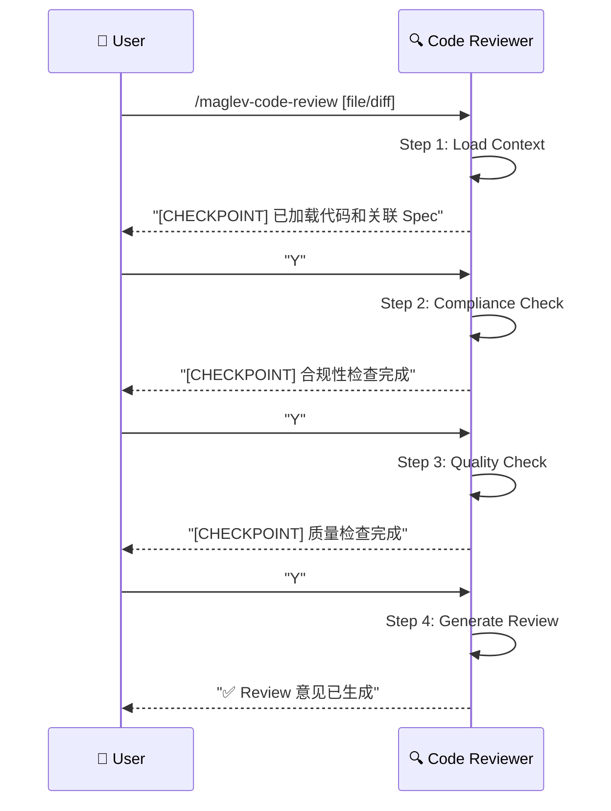

# 后端代码审查 (Backend Code Review)

> **Role**: [Backend Code Reviewer]
> **Mission**: 确保后端代码变更符合 Spec 设计，符合质量标准，提供可操作的 Review 意见。

## ⚠️ 核心规则
1.  **Spec-First**: 所有合规性检查以 Spec 为基准。
2.  **Constructive**: 意见必须可操作，指出问题并建议修复方案。
3.  **Guided Mode**: 每个 Step 后暂停，展示中间结果，等待用户确认。
4.  **Relative Paths**: 所有文件引用使用项目相对路径。

---

## 🚀 交互流程



---

## 📋 步骤详解

### Step 1: Load Context (加载上下文)
**Goal**: 加载代码变更和关联的 Spec 文件。
**Reference**: `references/step-01-load-context.md`
**Input**:
- 代码文件或 Git Diff
- 关联的 Spec 路径 (可自动识别或用户指定)

**Checkpoint**:
> "上下文已加载。
> - 代码变更: `OrderController.java` (+45 / -12 行)
> - 关联 Spec: `specs/10_reality/reverse_order_management/02_design.md`
> - APIs 涉及: `GET /api/orders`, `POST /api/orders`
> 是否继续检查合规性？[Y/n]"

### Step 2: Compliance Check (合规性检查)
**Goal**: 检查代码是否符合 Spec 定义。
**Reference**: `references/step-02-compliance-check.md`
**检查项**:
| 维度 | 检查内容 |
|------|----------|
| API 契约 | 路径、Method、参数、返回类型是否匹配 |
| 数据模型 | Entity 字段是否与 Schema 一致 |
| 业务逻辑 | 是否实现了 Spec 描述的行为 |

**Checkpoint**:
> "合规性检查完成。
> ✅ API 契约: 2/2 符合
> ⚠️ 数据模型: 1 个字段类型不匹配 (Order.status: String vs Enum)
> ✅ 业务逻辑: 符合 Spec 描述
> 是否继续检查代码质量？[Y/n]"

### Step 3: Quality Check (质量检查)
**Goal**: 检查代码质量和最佳实践。
**Reference**: `references/step-03-quality-check.md`
**检查项**:
| 维度 | 检查内容 |
|------|----------|
| 命名规范 | 变量/方法命名是否清晰 |
| 错误处理 | 是否有适当的异常处理 |
| 边界条件 | 是否处理了空值/边界情况 |
| 代码复杂度 | 方法是否过长/嵌套过深 |
| 安全性 | 是否有 SQL 注入/XSS 等风险 |

**Checkpoint**:
> "质量检查完成。
> ⚠️ 错误处理: `deleteOrder()` 缺少异常捕获
> ⚠️ 边界条件: `page` 参数未校验负数
> 🟢 命名规范: 良好
> 🟢 安全性: 未发现风险
> 是否生成 Review 意见？[Y/n]"

### Step 4: Generate Review (生成 Review)
**Goal**: 输出结构化的 Review 意见。
**Reference**: `references/step-04-generate-review.md`
**Output**: Review Comments (可复制到 PR)

---

## 📊 输出格式

### Review 意见模板
```markdown
## Code Review: OrderController.java

### 📊 总评
- **合规性**: 🟡 基本符合 (1 个问题)
- **质量**: 🟡 需改进 (2 个问题)
- **建议**: 修复后可合并

---

### 🔴 必须修复 (Blocking)

#### [Compliance] Order.status 类型不匹配
**位置**: `Order.java:L15`
**Spec 定义**: `status: Enum<PENDING, COMPLETED, CANCELLED>`
**实际代码**: `private String status;`
**建议**:
```java
// 修改为
private OrderStatus status;

enum OrderStatus { PENDING, COMPLETED, CANCELLED }
```

---

### 🟡 建议修复 (Non-Blocking)

#### [Quality] deleteOrder 缺少异常处理
**位置**: `OrderController.java:L42`
**问题**: 直接调用 `repository.deleteById()` 无异常捕获
**建议**:
```java
try {
    repository.deleteById(id);
} catch (EmptyResultDataAccessException e) {
    throw new ResourceNotFoundException("Order not found: " + id);
}
```

---

### 🟢 Good (值得肯定)
- 清晰的方法命名
- 合理的分层结构
```

---

## 必需的参考资料
- 工作流入口：`references/code-review.workflow.md`
- Step 1：`references/step-01-load-context.md`
- Step 2：`references/step-02-compliance-check.md`
- Step 3：`references/step-03-quality-check.md`
- Step 4：`references/step-04-generate-review.md`
