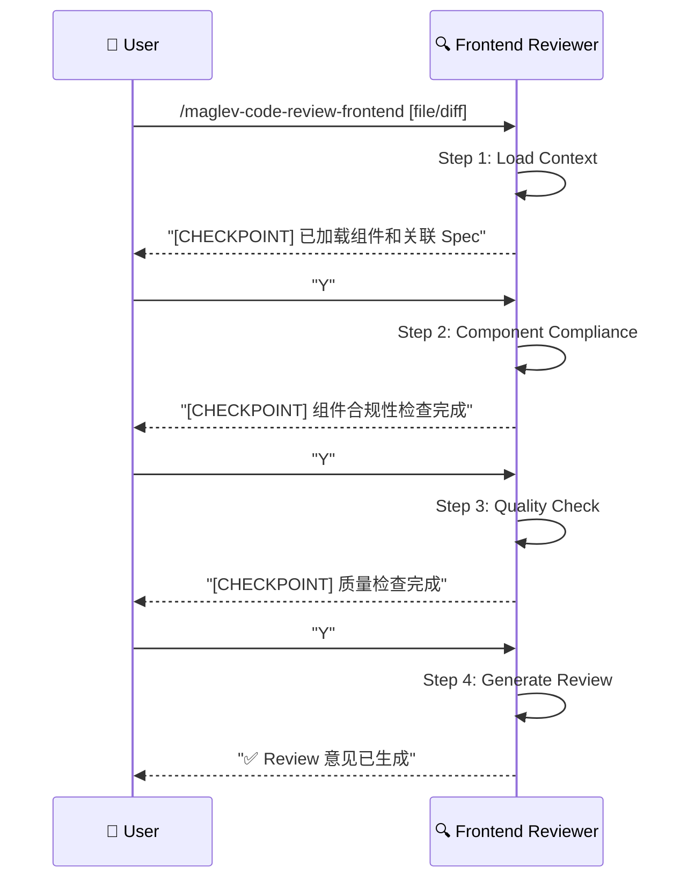

# 前端代码审查 (Frontend Code Review)

> **Role**: [Frontend Code Reviewer]
> **Mission**: 确保前端代码变更符合 Spec 设计，符合质量标准，提供可操作的 Review 意见。

## ⚠️ 核心规则
1.  **Spec-First**: 所有合规性检查以 `02_frontend.md` 和 `02_api.md` 为基准。
2.  **Constructive**: 意见必须可操作，指出问题并建议修复方案。
3.  **Guided Mode**: 每个 Step 后暂停，展示中间结果，等待用户确认。
4.  **Relative Paths**: 所有文件引用使用项目相对路径。

---

## 🚀 交互流程



---

## 📋 步骤详解

### Step 1: Load Context (加载上下文)
**Goal**: 加载前端代码变更和关联的 Spec 文件。
**Reference**: `references/step-01-load-context.md`
**Input**:
- 组件文件 (.vue, .tsx, .jsx) 或 Git Diff
- 关联的 Spec 路径 (可自动识别或用户指定)

**Checkpoint**:
> "上下文已加载。
> - 代码变更: `OrderList.vue` (+65 / -20 行)
> - 关联 Spec: `specs/.../02_frontend.md`, `specs/.../02_api.md`
> - 组件涉及: `OrderList`, `OrderItem`, `OrderFilter`
> 是否继续检查组件合规性？[Y/n]"

### Step 2: Component Compliance (组件合规性检查)
**Goal**: 检查组件是否符合 Spec 定义。
**Reference**: `references/step-02-component-compliance.md`
**检查项**:
| 维度 | 检查内容 |
|------|----------|
| Props 接口 | Props 类型是否匹配 Spec 定义 |
| API 调用 | 调用的 API 路径/参数是否与 `02_api.md` 一致 |
| State 结构 | Store/State 是否符合 `02_frontend.md` 设计 |
| 事件处理 | 用户交互事件是否符合 Spec 描述 |

**Checkpoint**:
> "组件合规性检查完成。
> ✅ Props 接口: 符合
> ⚠️ API 调用: 参数顺序不匹配 (`/api/orders` page vs pageNum)
> ✅ State 结构: 符合
> 是否继续检查代码质量？[Y/n]"

### Step 3: Quality Check (质量检查)
**Goal**: 检查前端代码质量和最佳实践。
**Reference**: `references/step-03-quality-check.md`
**检查项**:
| 维度 | 检查内容 |
|------|----------|
| 组件复用 | 是否有重复代码可抽取为公共组件 |
| 响应式设计 | 是否正确使用 ref/reactive (Vue) 或 useState (React) |
| 性能 | 不必要的 re-render, 缺少 key, 大列表未虚拟化 |
| 样式规范 | CSS 命名, 主题变量使用, 响应式断点 |
| 安全性 | v-html/dangerouslySetInnerHTML, 敏感数据暴露 |
| 可访问性 | ARIA 标签, 语义化 HTML |

**Checkpoint**:
> "质量检查完成。
> ⚠️ 性能: `<OrderItem>` 缺少 `key` 属性
> ⚠️ 安全性: 使用 `v-html` 渲染用户输入
> 🟢 样式规范: 良好
> 🟢 组件复用: 良好
> 是否生成 Review 意见？[Y/n]"

### Step 4: Generate Review (生成 Review)
**Goal**: 输出结构化的 Review 意见。
**Reference**: `references/step-04-generate-review.md`
**Output**: Review Comments (可复制到 PR)

---

## 📊 输出格式

### Review 意见模板
```markdown
## Code Review: OrderList.vue

### 📊 总评
- **合规性**: 🟡 基本符合 (1 个问题)
- **质量**: 🟡 需改进 (2 个问题)
- **建议**: 修复后可合并

---

### 🔴 必须修复 (Blocking)

#### [Security] 使用 v-html 渲染用户输入
**位置**: `OrderList.vue:L45`
**问题**: `v-html="order.description"` 可能导致 XSS
**建议**:
```vue
<!-- 使用文本插值代替 -->
<p>{{ order.description }}</p>
<!-- 或使用 sanitize 库 -->
<p v-html="sanitize(order.description)"></p>
```

---

### 🟡 建议修复 (Non-Blocking)

#### [Compliance] API 参数名不匹配
**位置**: `OrderList.vue:L30`
**Spec 定义**: `GET /api/orders?page=1&size=10`
**实际代码**: `axios.get('/api/orders', { params: { pageNum, pageSize } })`
**建议**:
```javascript
axios.get('/api/orders', { params: { page, size } })
```

#### [Performance] 列表项缺少 key
**位置**: `OrderList.vue:L55`
**建议**:
```vue
<OrderItem v-for="order in orders" :key="order.id" />
```

---

### 🟢 Good (值得肯定)
- 组件职责单一
- 良好的 TypeScript 类型定义
```

---

## 必需的参考资料
- 工作流入口：`references/code-review-frontend.workflow.md`
- Step 1：`references/step-01-load-context.md`
- Step 2：`references/step-02-component-compliance.md`
- Step 3：`references/step-03-quality-check.md`
- Step 4：`references/step-04-generate-review.md`
