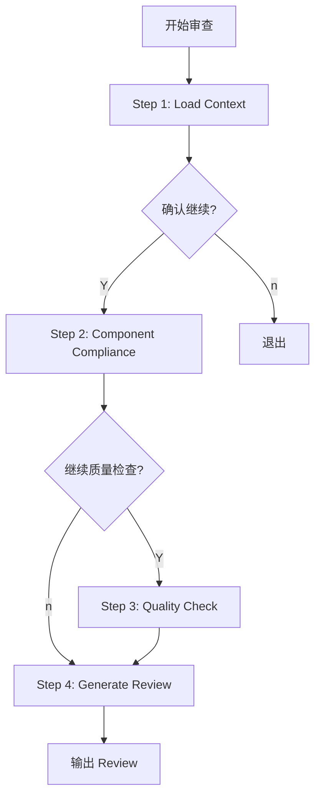

# Frontend Code Review Workflow

## 流程概览

## Checkpoint 规则
1.  Step 1 后：展示加载的组件和关联 Spec
2.  Step 2 后：展示组件合规性检查结果
3.  Step 3 后：展示质量检查结果
4.  Step 4 后：输出 Review 意见

## 输入方式
- **单文件**: `/maglev-code-review-frontend src/views/OrderList.vue`
- **Git Diff**: `/maglev-code-review-frontend --diff HEAD~1`
- **指定 Spec**: `/maglev-code-review-frontend src/views/OrderList.vue --spec specs/.../02_frontend.md`
