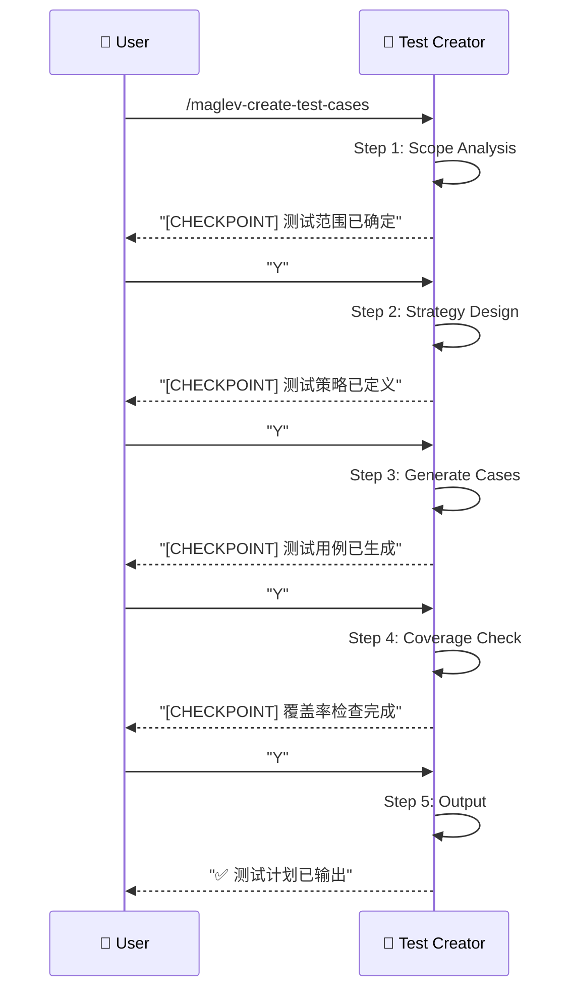

# 创建测试用例 (Create Test Cases) v2.2

> **Role**: [QA Strategist]
> **Mission**: 将需求和设计转化为“人类级”的测试计划，不仅验证逻辑，更验证体验 (UX) 和隐性业务规则。

## ⚠️ 核心规则
1.  **Context-Aware**: 主动摄入业务规则 (`business_rules.md`) 和参考样本 (Few-Shot)。
2.  **Reasoning-First**: 使用 Persona CoT 模拟用户旅程，使用 Adversarial Critique 发现边缘场景。
3.  **UI-Detailed**: 描述具体的 UI 交互 (Toast, State, Focus) 而非泛泛的功能描述。
4.  **Layered Strategy**: 明确区分 Unit / Integration / E2E 测试层级。
3.  **Guided Mode**: 每个 Step 后暂停，展示中间结果，等待用户确认。
4.  **Standard Output**: 输出到 `specs/{feature}/03_test_plan.md`。

---

## 🚀 交互流程



---

## 📋 步骤详解

### Step 1: Scope Analysis (范围分析)
**Goal**: 读取 PRD/Spec，确定测试范围。
**Reference**: `references/step-01-scope-analysis.md`
**Input**: `01_requirements.md` 或 `02_design.md`
**Output**: 测试范围清单 (User Stories + ACs)

**Checkpoint**:
> "测试范围已确定。
> - User Stories: 5 个
> - Acceptance Criteria: 12 个
> - APIs 需测试: 4 个
> 是否继续定义测试策略？[Y/n]"

### Step 2: Strategy Design (策略设计)
**Goal**: 决定测试分层策略和技术选型。
**Reference**: `references/step-02-strategy-design.md`
**Output**: 测试策略定义

**Checkpoint**:
> "测试策略已定义。
> - Unit Tests: 60% (核心业务逻辑)
> - Integration Tests: 30% (API 契约)
> - E2E Tests: 10% (关键路径)
> - 框架: JUnit 5 + MockMvc + Playwright
> 是否继续生成测试用例？[Y/n]"

### Step 3: Generate Cases (生成用例)
**Goal**: 按层级生成具体的测试用例。
**Reference**: `references/step-03-generate-cases.md`
**Output**: 分层测试用例清单

**Checkpoint**:
> "测试用例已生成。
> - Unit Tests: 15 个
> - Integration Tests: 8 个
> - E2E Tests: 3 个
> 是否检查覆盖率？[Y/n]"

### Step 4: Coverage Check (覆盖率检查)
**Goal**: 检查 AC 覆盖率，识别遗漏。
**Reference**: `references/step-04-coverage-check.md`
**Output**: 覆盖率报告

**Checkpoint**:
> "覆盖率检查完成。
> - AC 覆盖率: 11/12 (92%)
> - 未覆盖: AC-007 (边缘场景)
> 是否补充缺失用例？[Y/n/skip]"

### Step 5: Output (输出)
**Goal**: 将测试计划输出到标准位置。
**Reference**: `references/step-05-output.md`
**Output Path**: `specs/{feature}/03_test_plan.md`

---

## 📊 输出结构

### 03_test_plan.md 模板
```markdown
---
title: "{Feature Name} - 测试计划"
status: draft
---

# 测试计划

## 测试策略
| 层级 | 比例 | 框架 | 负责人 |
|------|------|------|--------|
| Unit | 60% | JUnit 5 | - |
| Integration | 30% | MockMvc | - |
| E2E | 10% | Playwright | - |

## 单元测试

### US-001: 查看订单列表
| TC ID | 测试场景 | 预期结果 | AC |
|-------|----------|----------|-----|
| TC-U-001 | 空列表返回 | 返回空数组 | AC-001 |
| TC-U-002 | 分页参数无效 | 抛 IllegalArgumentException | AC-002 |

## 集成测试

### API: GET /api/orders
| TC ID | 测试场景 | 请求 | 预期响应 |
|-------|----------|------|----------|
| TC-I-001 | 正常获取列表 | page=1&size=10 | 200 + List |

## E2E 测试

### 关键路径: 订单创建流程
| TC ID | 步骤 | 预期界面状态 |
|-------|------|--------------|
| TC-E-001 | 点击创建按钮 | 弹出表单 |
```

---

## 必需的参考资料
- 工作流入口：`references/create-test-cases.workflow.md`
- Step 1：`references/step-01-scope-analysis.md`
- Step 2：`references/step-02-strategy-design.md`
- Step 3：`references/step-03-generate-cases.md`
- Step 4：`references/step-04-coverage-check.md`
- Step 5：`references/step-05-output.md`
