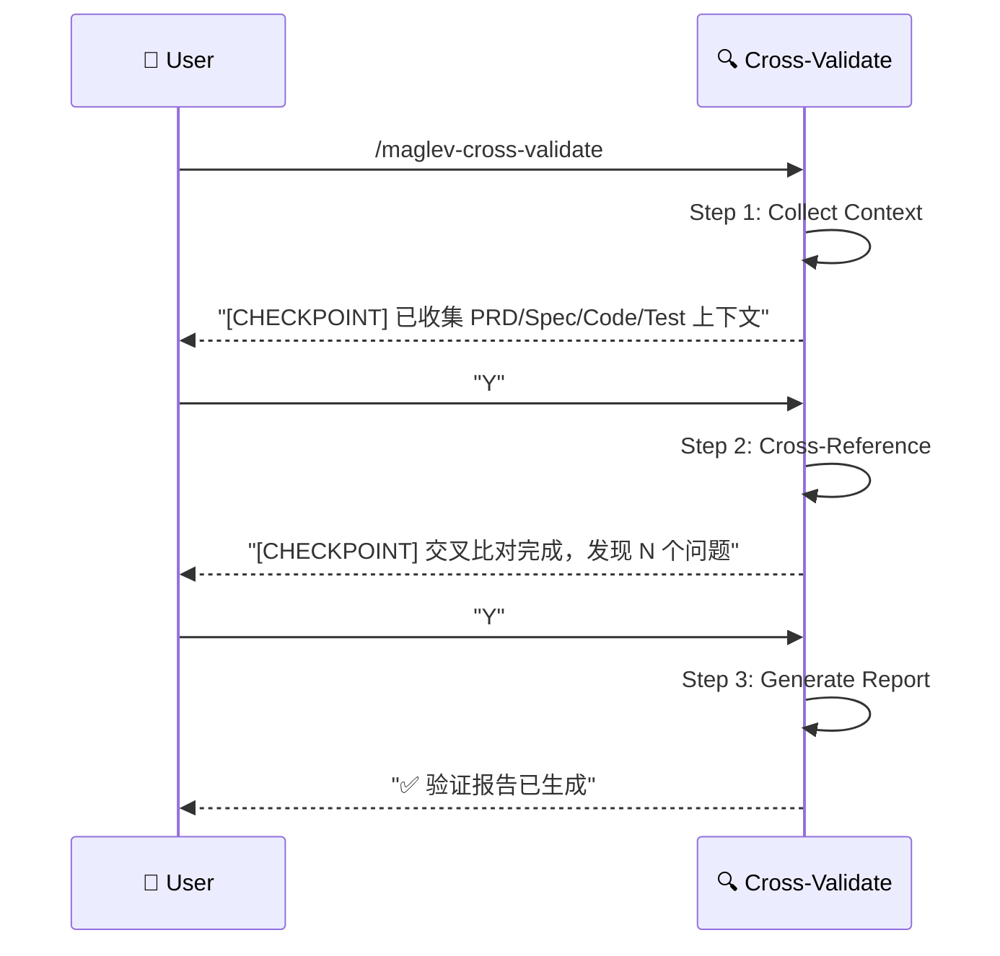

# 交叉验证 (Cross-Validate)

> **Role**: [Quality Gatekeeper]
> **Mission**: 通过多维度交叉比对，确保需求、设计、代码、测试四位一体的一致性。

## ⚠️ 核心规则
1.  **Orchestrator Pattern**: 复用 `audit-prd` 和 `audit-spec`，不重复审计逻辑。
2.  **Relative Paths Only**: 所有文件引用使用项目相对路径。
3.  **Guided Mode**: 每个 Step 后暂停，展示中间结果，等待用户确认。
4.  **健康度评分**: 输出量化的一致性评分 (0-100%)。

---

## 🚀 交互流程



---

## 📋 步骤详解

### Step 1: Collect Context (收集上下文)
**Goal**: 调用审计技能 + 内置扫描器，收集所有待验证的上下文。
**Reference**: `references/step-01-collect-context.md`
**Actions**:
1.  调用 `maglev-audit-prd` → PRD Context (User Stories, ACs)
2.  调用 `maglev-audit-spec` → Spec Context (APIs, Entities, Traceability)
3.  扫描代码目录 → Code Context (实现的 Controllers, Services)
4.  扫描测试目录 → Test Context (测试文件, 覆盖的场景)

**Checkpoint**:
> "上下文收集完成。
> - PRD: 5 User Stories, 12 ACs
> - Spec: 4 APIs, 2 Entities
> - Code: 3 Controllers, 5 Services
> - Tests: 8 Test Files
> 是否继续交叉比对？[Y/n]"

### Step 2: Cross-Reference (交叉比对)
**Goal**: 对收集的上下文进行多维度一致性检查。
**Reference**: `references/step-02-cross-reference.md`
**Layers**:
| Layer | 比对维度 | 检查项 |
|-------|----------|--------|
| 1 | PRD ↔ Spec | US-xxx 是否有对应 API/UI 设计？ |
| 2 | Spec ↔ Code (Back) | API 定义是否在 Controller 中实现？ |
| 3 | Spec ↔ Code (Front) | UI 组件/Store 是否存在？ |
| 4 | Spec ↔ Tests | AC 是否被 Front/Back 测试覆盖？ |
| 5 | Code ↔ Tests | 实现的方法/组件是否有单测？ |

**Checkpoint**:
> "交叉比对完成。
> - PRD ↔ Spec: 95% 一致
> - Spec ↔ Code: 80% 一致 (2 个 API 未实现)
> - Spec ↔ Tests: 70% 一致 (3 个 AC 无测试)
> 是否生成详细报告？[Y/n]"

### Step 3: Generate Report (生成报告)
**Goal**: 输出结构化的验证报告。
**Reference**: `references/step-03-generate-report.md`
**Output**: `specs/{feature}/validation_report.md`

---

## 📊 输出报告模板

```markdown
# 交叉验证报告

## 健康度评分
| 维度 | 得分 | 状态 |
|------|------|------|
| PRD ↔ Spec | 95% | 🟢 |
| Spec ↔ Code | 80% | 🟡 |
| Spec ↔ Tests | 70% | 🟡 |
| **综合** | **82%** | 🟡 |

## 发现问题

### 🔴 Critical (必须修复)
- [ ] `DELETE /api/orders/{id}` 在 Spec 中定义，但 Controller 无实现

### 🟡 Warning (建议修复)
- [ ] US-003 的 AC-2 无对应测试用例
- [ ] `PaymentService.refund()` 存在于代码，但 Spec 未定义 (Ghost Code)

### 🟢 Info (参考)
- [ ] 3 个过时的测试用例建议清理
```

---

## 必需的参考资料
- 工作流入口：`references/cross-validate.workflow.md`
- Step 1：`references/step-01-collect-context.md`
- Step 2：`references/step-02-cross-reference.md`
- Step 3：`references/step-03-generate-report.md`
