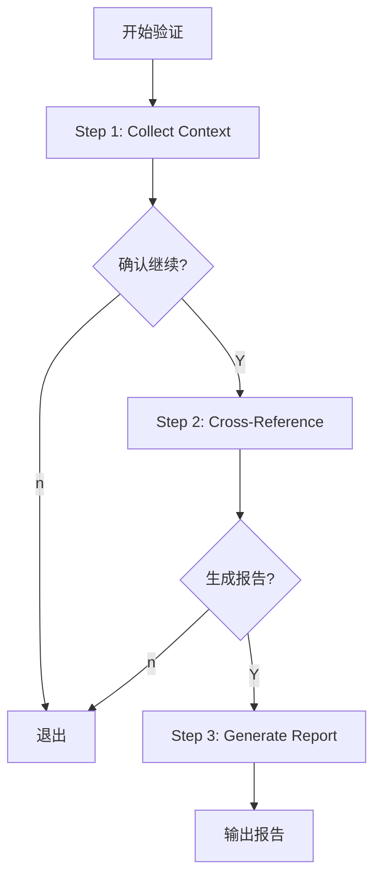

# Cross-Validate Workflow

## 流程概览

## 编排规则

### 调用的子技能
| 技能 | 阶段 | 产出 |
|------|------|------|
| `maglev-audit-prd` | Step 1 | PRD Context |
| `maglev-audit-spec` | Step 1 | Spec Context |

### 内置扫描器
| 扫描器 | 阶段 | 产出 |
|--------|------|------|
| Code Scanner | Step 1 | Code Context |
| Test Scanner | Step 1 | Test Context |

## Checkpoint 规则
1.  Step 1 后：展示上下文统计
2.  Step 2 后：展示健康度评分
3.  Step 3 后：输出报告路径
