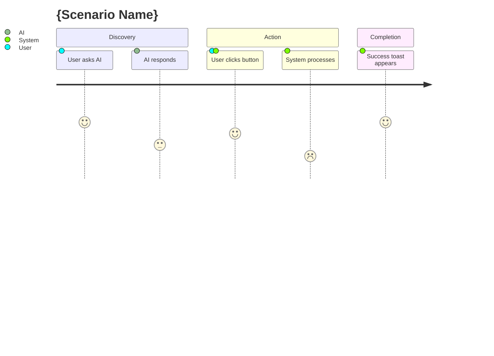

# Step 2: Journey (旅程设计)

## 目标
可视化用户与系统的交互流程，识别情绪高低点。

## 动作
1.  **Draft**: 基于需求设计操作流程。
2.  **Visualize**: 生成 Mermaid User Journey Diagram。
3.  **Enhance**: 标注 "Pain Point" (痛点) 和 "Opportunity" (机会点)。

## 模板 (Mermaid Journey)

## 关键点
*   不仅仅是流程图，要包含 **User Feeling** (Score 1-5)。
*   识别哪一步最容易让用户挫败 (Score < 3)。
