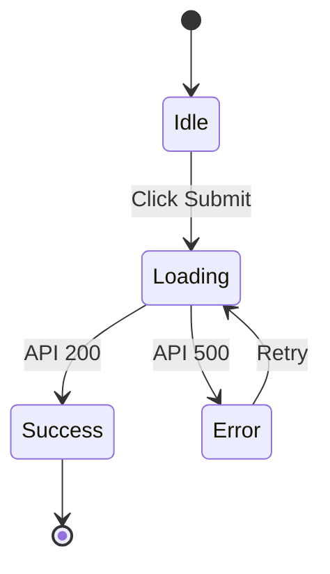

# Step 3: Visual (视觉逻辑)

## 目标
定义关键 UI 组件在不同状态下的表现，拒绝 "Happy Path Only"。

## 动作
1.  **Identify**: 找出页面上的核心交互组件 (e.g., Form, List, Button)。
2.  **State Logic**: 定义 Idle, Loading, Error, Success, Empty 等状态。
3.  **Visualize**: 生成 Mermaid State Diagram。

## 模板 (State Diagram)

## 交付物
*   **Component List**: 关键组件清单。
*   **State Diagram**: 状态流转图。
*   **Key Feedback**: 关键的 Toast/Modal 文案。
