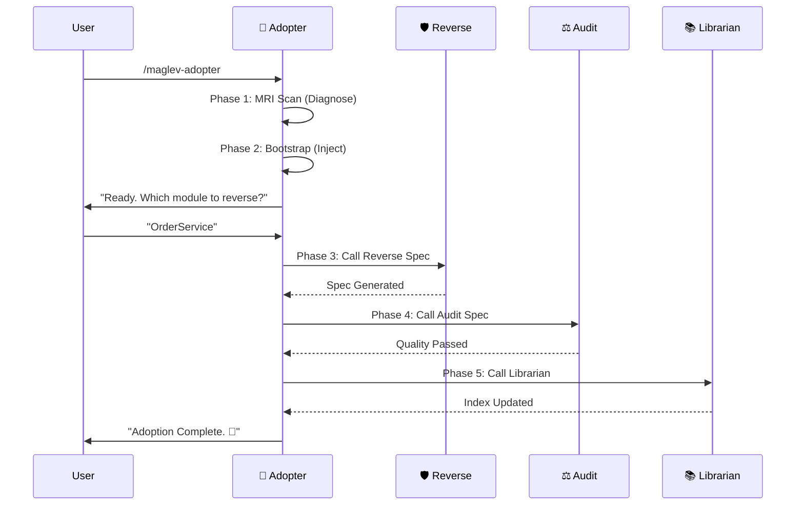

# Legacy Adopter Workflow

本工作流编排了从"环境诊断"到"资产入库"的全过程。

## 流程图 (Sequence)

## 详细指令

### Step 1: MRI & Bootstrap
执行 `references/step-01-mri-scan.md` 和 `references/step-02-bootstrap.md`。
确保环境就绪。

### Step 2: Reverse Engineering (Delegation)
调用 `maglev-reverse-spec`。
**Critical**: 必须等待其完成后，获取生成的 Spec 路径。

### Step 3: Audit (Delegation)
调用 `maglev-audit-spec`。
目标路径: Step 2 生成的 Spec 目录。

### Step 4: Indexing (Delegation)
调用 `maglev-librarian`。
模式: Track A (Spec Curator).

## 结束语
"您的项目已成功接入 Maglev。
1. 核心模块已逆向为 Spec。
2. Spec 已通过质量审计。
3. 资产已登记在册。
请查阅 `specs/README.md` 开始您的演进之旅。"
