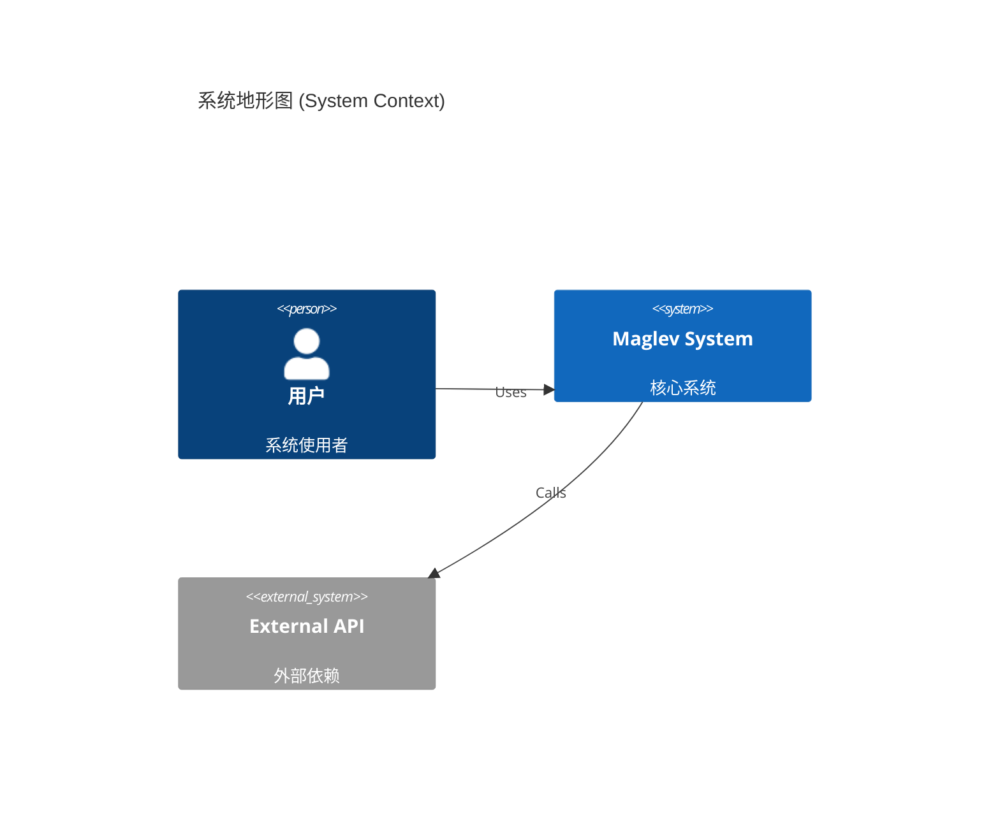

# Step 1b: Terrain Map (地形地图)

## 目标
可视化 `specs/10_reality` 定义的系统结构 (Space)。

## 绘制指令
1.  **扫描文件**: 扫描 `specs/10_reality/`。
2.  **追加章节**: 向 `docs/ATLAS.md` **追加** 内容。
3.  **写入标题**: `## 2. 🏔️ Terrain Map (地形层)`。
4.  **嵌入图表**: 使用 \`\`\`mermaid 包裹 C4/Class Diagram 代码。
5.  **必须使用中文 Label**。

### 模板 (C4 Context)

### 状态推导
*   如果 `10_reality` 为空，显示 "荒原 (Wasteland)"。
*   如果存在 `02_req_infra.md`，提取其中的 System Boundary。
