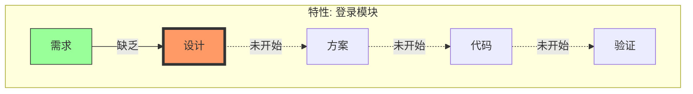

# Step 3: Street Map (街道地图)

## 目标
回答 "我手头这个功能下一步该干嘛？"

## 绘制指令
1.  **选择特性**: 挑选最活跃的 Feature。
2.  **追加章节**: 向 `docs/ATLAS.md` **追加** 内容。
3.  **写入标题**: `## 4. 🛣️ Street Map (执行层)`。
4.  **嵌入图表**: 使用 \`\`\`mermaid 包裹 Flowchart TD 代码 (V-Model)。
5.  **必须使用中文 Label**。

### 状态推导 (ADSI)
*   `01_requirements.md` ✅ -> **需求就绪**
*   `02_ui_design.md` ❌ -> **缺少设计** (Next Step)
*   `03_tech_plan.md` ❌ -> **缺少方案**
*   `src/...` ❌ -> **未开发**

### 模板

