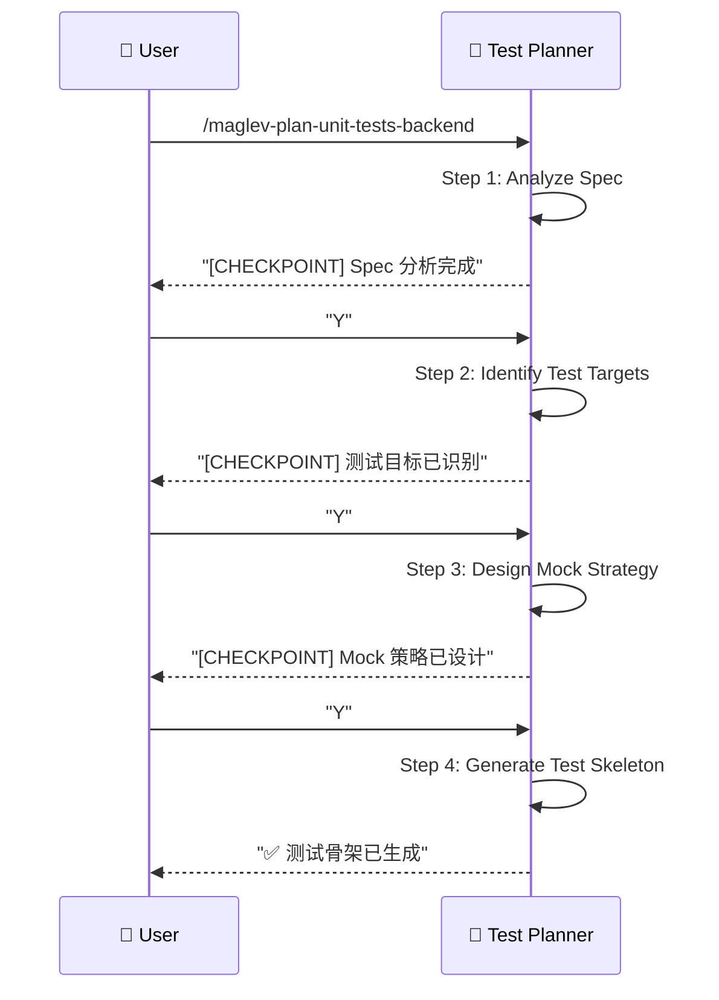

# 后端单测规划 (Backend Unit Test Planning)

> **Role**: [Test Architect]
> **Mission**: 将 Tech Spec 转化为可执行的单元测试骨架，确保业务逻辑有完整的测试覆盖。

## ⚠️ 核心规则
1.  **Spec-Driven**: 测试目标来源于 `02_design.md` 的 API 和业务逻辑。
2.  **Layer-Aware**: 区分 Controller / Service / Repository 层级。
3.  **Guided Mode**: 每个 Step 后暂停，展示中间结果，等待用户确认。
4.  **Executable Output**: 输出可直接运行的测试代码骨架。

---

## 🚀 交互流程



---

## 📋 步骤详解

### Step 1: Analyze Spec (分析规格)
**Goal**: 读取 Tech Spec，提取可测试的目标。
**Reference**: `references/step-01-analyze-spec.md`
**Input**: `02_design.md` (或 `02_api.md`, `02_schema.md`)

**提取内容**:
- API Endpoints (Controller 层测试目标)
- Business Rules (Service 层测试目标)
- Data Access (Repository 层测试目标)

**Checkpoint**:
> "Spec 分析完成。
> - APIs: 4 个 (GET, POST, PUT, DELETE)
> - Business Rules: 3 个 (订单金额校验, 库存检查, 状态流转)
> - Entities: 2 个 (Order, OrderItem)
> 是否继续识别测试目标？[Y/n]"

### Step 2: Identify Test Targets (识别测试目标)
**Goal**: 将 Spec 转化为具体的测试方法签名。
**Reference**: `references/step-02-identify-targets.md`

**输出格式**:
```yaml
test_targets:
  controller:
    - class: OrderControllerTest
      methods:
        - testGetOrders_Success
        - testGetOrders_EmptyList
        - testCreateOrder_Success
        - testCreateOrder_InvalidInput
  service:
    - class: OrderServiceTest
      methods:
        - testCalculateTotalAmount_Normal
        - testCalculateTotalAmount_WithDiscount
        - testCheckStock_Sufficient
        - testCheckStock_Insufficient
  repository:
    - class: OrderRepositoryTest
      methods:
        - testFindByUserId
        - testSave
```

**Checkpoint**:
> "测试目标已识别。
> - Controller Tests: 8 个
> - Service Tests: 12 个
> - Repository Tests: 4 个
> 是否继续设计 Mock 策略？[Y/n]"

### Step 3: Design Mock Strategy (设计 Mock 策略)
**Goal**: 确定每个测试的 Mock 对象和 Stub 行为。
**Reference**: `references/step-03-mock-strategy.md`

**Mock 类型**:
| 层级 | Mock 对象 | 说明 |
|------|-----------|------|
| Controller | Service | Mock Service 返回值 |
| Service | Repository, 外部服务 | Mock DB 查询, 外部 API |
| Repository | DataSource (可选) | 通常用真实 H2/TestContainers |

**Checkpoint**:
> "Mock 策略已设计。
> - OrderControllerTest: Mock OrderService
> - OrderServiceTest: Mock OrderRepository, InventoryClient
> - OrderRepositoryTest: Use H2 in-memory database
> 是否生成测试骨架？[Y/n]"

### Step 4: Generate Test Skeleton (生成测试骨架)
**Goal**: 输出可执行的测试代码框架。
**Reference**: `references/step-04-generate-skeleton.md`
**Output**: `src/test/java/.../OrderServiceTest.java` (或对应路径)

---

## 📊 输出格式

### Java (JUnit 5 + Mockito) 示例
```java
@ExtendWith(MockitoExtension.class)
class OrderServiceTest {

    @Mock
    private OrderRepository orderRepository;
    
    @Mock
    private InventoryClient inventoryClient;
    
    @InjectMocks
    private OrderService orderService;
    
    // === Happy Path ===
    
    @Test
    @DisplayName("计算订单总金额 - 正常情况")
    void testCalculateTotalAmount_Normal() {
        // Given
        Order order = new Order();
        order.setItems(List.of(
            new OrderItem("SKU-001", 2, BigDecimal.valueOf(100))
        ));
        
        // When
        BigDecimal total = orderService.calculateTotalAmount(order);
        
        // Then
        assertThat(total).isEqualTo(BigDecimal.valueOf(200));
    }
    
    // === Edge Cases ===
    
    @Test
    @DisplayName("计算订单总金额 - 空订单")
    void testCalculateTotalAmount_EmptyOrder() {
        // TODO: Implement
    }
    
    // === Error Cases ===
    
    @Test
    @DisplayName("库存检查 - 库存不足抛异常")
    void testCheckStock_Insufficient() {
        // Given
        when(inventoryClient.getStock("SKU-001")).thenReturn(0);
        
        // When & Then
        assertThrows(InsufficientStockException.class, () -> {
            orderService.checkStock("SKU-001", 10);
        });
    }
}
```

---

## 必需的参考资料
- 工作流入口：`references/plan-unit-tests.workflow.md`
- Step 1：`references/step-01-analyze-spec.md`
- Step 2：`references/step-02-identify-targets.md`
- Step 3：`references/step-03-mock-strategy.md`
- Step 4：`references/step-04-generate-skeleton.md`
