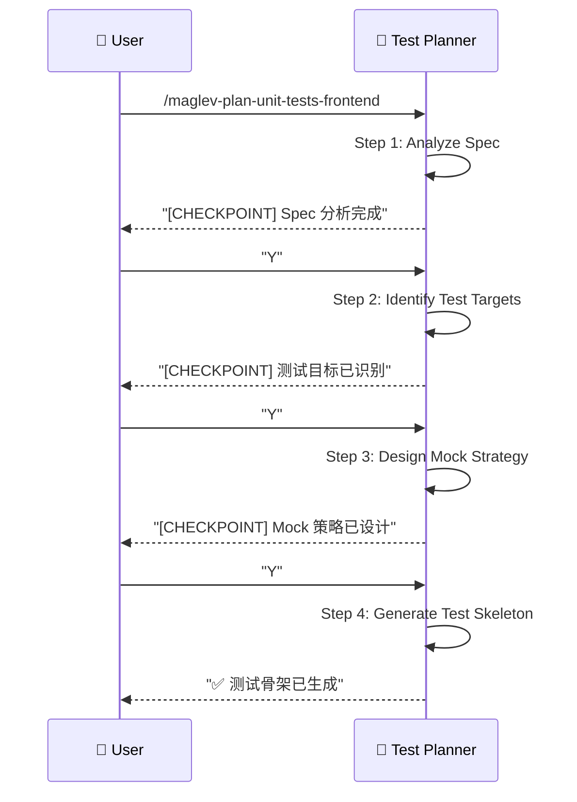

# 前端单测规划 (Frontend Unit Test Planning)

> **Role**: [Frontend Test Architect]
> **Mission**: 将 Tech Spec 转化为可执行的前端测试骨架，确保组件和业务逻辑有完整的测试覆盖。

## ⚠️ 核心规则
1.  **Spec-Driven**: 测试目标来源于 `02_frontend.md` 的组件设计。
2.  **Layer-Aware**: 区分 Component / Hook / Store 层级。
3.  **Guided Mode**: 每个 Step 后暂停，展示中间结果，等待用户确认。
4.  **Executable Output**: 输出可直接运行的测试代码骨架。

---

## 🚀 交互流程



---

## 📋 步骤详解

### Step 1: Analyze Spec (分析规格)
**Goal**: 读取 Tech Spec，提取可测试的目标。
**Reference**: `references/step-01-analyze-spec.md`
**Input**: `02_frontend.md`

**提取内容**:
- Components (组件测试目标)
- Hooks/Composables (逻辑测试目标)
- Store/State (状态管理测试目标)

**Checkpoint**:
> "Spec 分析完成。
> - Components: 5 个 (OrderList, OrderItem, OrderFilter, OrderForm, OrderDetail)
> - Hooks: 2 个 (useOrderList, useOrderForm)
> - Store: 1 个 (orderStore)
> 是否继续识别测试目标？[Y/n]"

### Step 2: Identify Test Targets (识别测试目标)
**Goal**: 将 Spec 转化为具体的测试用例签名。
**Reference**: `references/step-02-identify-targets.md`

**输出格式**:
```yaml
test_targets:
  components:
    - name: OrderList.spec.ts
      tests:
        - renders order list correctly
        - shows empty state when no orders
        - triggers fetch on mount
        - handles pagination
  hooks:
    - name: useOrderList.spec.ts
      tests:
        - returns orders from store
        - handles loading state
        - handles error state
  store:
    - name: orderStore.spec.ts
      tests:
        - fetchOrders updates state
        - createOrder adds to list
        - deleteOrder removes from list
```

**Checkpoint**:
> "测试目标已识别。
> - Component Tests: 12 个
> - Hook Tests: 6 个
> - Store Tests: 8 个
> 是否继续设计 Mock 策略？[Y/n]"

### Step 3: Design Mock Strategy (设计 Mock 策略)
**Goal**: 确定每个测试需要 Mock 的依赖。
**Reference**: `references/step-03-mock-strategy.md`

**Mock 类型**:
| 测试层级 | Mock 对象 | 说明 |
|----------|-----------|------|
| **Component** | API, Router, Store | Mock 外部依赖 |
| **Hook** | API, Store | Mock 数据源 |
| **Store** | API | Mock 网络请求 |

**Checkpoint**:
> "Mock 策略已设计。
> - OrderList.spec.ts: Mock orderStore, useRouter
> - useOrderList.spec.ts: Mock orderStore
> - orderStore.spec.ts: Mock axios/fetch
> 是否生成测试骨架？[Y/n]"

### Step 4: Generate Test Skeleton (生成测试骨架)
**Goal**: 输出可执行的测试代码框架。
**Reference**: `references/step-04-generate-skeleton.md`
**Output**: `src/components/__tests__/OrderList.spec.ts` 等

---

## 📊 输出格式

### Vue (Vitest + Vue Test Utils) 示例
```typescript
import { describe, it, expect, vi, beforeEach } from 'vitest'
import { mount } from '@vue/test-utils'
import { createTestingPinia } from '@pinia/testing'
import OrderList from '../OrderList.vue'
import { useOrderStore } from '@/stores/order'

describe('OrderList', () => {
  beforeEach(() => {
    vi.clearAllMocks()
  })

  // ===== Rendering =====
  
  describe('rendering', () => {
    it('renders order list correctly', () => {
      const wrapper = mount(OrderList, {
        global: {
          plugins: [createTestingPinia({
            initialState: {
              order: { orders: [{ id: 1, name: 'Test Order' }] }
            }
          })]
        }
      })
      
      expect(wrapper.findAll('[data-testid="order-item"]')).toHaveLength(1)
    })
    
    it('shows empty state when no orders', () => {
      const wrapper = mount(OrderList, {
        global: {
          plugins: [createTestingPinia()]
        }
      })
      
      expect(wrapper.find('[data-testid="empty-state"]').exists()).toBe(true)
    })
  })
  
  // ===== Interactions =====
  
  describe('interactions', () => {
    it('triggers fetch on mount', async () => {
      mount(OrderList, {
        global: {
          plugins: [createTestingPinia({ stubActions: false })]
        }
      })
      
      const store = useOrderStore()
      expect(store.fetchOrders).toHaveBeenCalled()
    })
  })
})
```

### React (Vitest + Testing Library) 示例
```typescript
import { describe, it, expect, vi } from 'vitest'
import { render, screen } from '@testing-library/react'
import { OrderList } from './OrderList'
import { useOrderStore } from '@/stores/order'

vi.mock('@/stores/order')

describe('OrderList', () => {
  it('renders order list correctly', () => {
    vi.mocked(useOrderStore).mockReturnValue({
      orders: [{ id: 1, name: 'Test Order' }],
      fetchOrders: vi.fn()
    })
    
    render(<OrderList />)
    
    expect(screen.getByTestId('order-item')).toBeInTheDocument()
  })
})
```

---

## 必需的参考资料
- 工作流入口：`references/plan-unit-tests-frontend.workflow.md`
- Step 1：`references/step-01-analyze-spec.md`
- Step 2：`references/step-02-identify-targets.md`
- Step 3：`references/step-03-mock-strategy.md`
- Step 4：`references/step-04-generate-skeleton.md`
