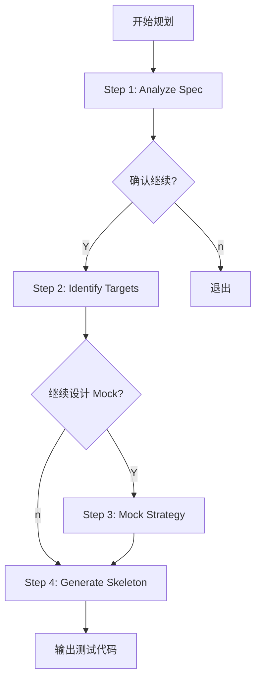

# Frontend Unit Test Planning Workflow

## 流程概览

## Checkpoint 规则
1.  Step 1 后：展示 Spec 分析结果
2.  Step 2 后：展示测试目标清单
3.  Step 3 后：展示 Mock 策略
4.  Step 4 后：输出测试骨架代码

## 输入方式
- **指定 Spec**: `/maglev-plan-unit-tests-frontend specs/.../02_frontend.md`
- **指定组件**: `/maglev-plan-unit-tests-frontend src/views/OrderList.vue`
