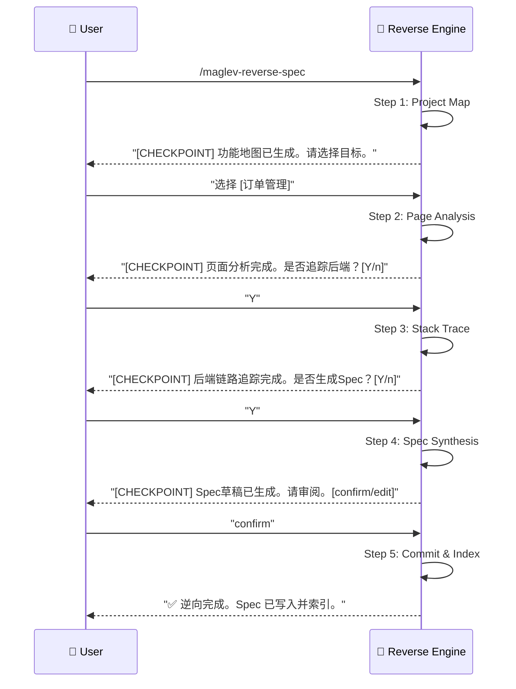

# 逆向 Spec (Reverse Spec) v2.0

> **Role**: [Software Archaeologist] + [Full-Stack Detective]
> **Mission**: 通过 "Page-First" 策略，从用户可见的页面入手，追踪前后端调用链，生成符合 00-03 标准的完整 Spec Cluster。

## ⚠️ 核心规则
1.  **Page-First (页面优先)**: 有 UI 的项目，先逆向页面，再追踪后端。无 UI 的纯服务，直接逆向 API。
2.  **Trust Chain (信任链)**: `Tests > Code > Comments`。测试是硬证据，代码是软证据，注释是嫌疑人。
3.  **Guided Mode (引导模式)**: 每个 Step 后**强制暂停**，展示阶段性产物，等待用户 `[Y/n]` 确认。
4.  **Standard Output (标准输出)**: 产出必须符合 `00_index`, `01_requirements`, `02_design` 结构。
5.  **Relative Paths Only (相对路径)**: 所有源文件引用必须使用**项目根目录相对路径**，禁止绝对路径（隐私安全）。

---

## 🚀 交互流程 (Interactive Flow - Guided Mode)



---

## 📋 步骤详解 (Step Definitions)

### Step 1: Project Map (项目地图)
**Goal**: 识别技术栈，生成用户可感知的功能入口清单。
**Reference**: `references/step-01-project-map.md`
**Output**: Feature Map (功能地图 JSON/Markdown)。
**Checkpoint Prompt**:
> "项目扫描完成。
> - 技术栈: [Vue 3] + [Java Spring Boot]
> - 识别到以下功能入口:
>   1. 用户登录 (LoginPage.vue + AuthController.java)
>   2. 订单列表 (OrderList.vue + OrderService.java)
> 请输入数字选择一个功能开始，或输入 'all' 逐一处理。"

### Step 2: Page Analysis (页面分析)
**Goal**: 深入分析选定页面的 UI 结构、交互和 API 调用。
**Reference**: `references/step-02-page-analysis.md`
**Output**: Page Context (组件结构 + API 调用列表)。
**Checkpoint Prompt**:
> "页面分析完成: `OrderList.vue`.
> - 组件: OrderTable, Pagination, FilterBar
> - API 调用:
>   - `GET /api/orders` (列表)
>   - `DELETE /api/orders/{id}` (删除)
> 是否继续追踪后端？[Y/n]"

### Step 3: Stack Trace (全栈追踪)
**Goal**: 从 API 入口追踪到 Controller -> Service -> Repository -> Entity。
**Reference**: `references/step-03-stack-trace.md`
**Output**: Backend Context (调用链 + 数据模型)。
**Checkpoint Prompt**:
> "后端追踪完成。
> - Controller: `OrderController.java` (L20-L80)
> - Service: `OrderServiceImpl.java` (L15-L120)
> - Repository: `OrderRepository.java`
> - Entities: `Order`, `OrderItem`
> 是否继续生成 Spec？[Y/n]"

### Step 4: Spec Synthesis (规格合成)
**Goal**: 将分析结果合成为 00-03 标准 Spec 文件簇。
**Reference**: `references/step-04-spec-synthesis.md`
**Output Structure**:
```
specs/10_reality/reverse_{feature_slug}/
├── 00_index.md          <- 元数据 + 关联文件
├── 01_requirements.md   <- 还原的业务需求 (User Story)
├── 02_design.md         <- 技术设计 (API + Data Model)
└── (03_plan.md 逆向不涉及)
```
**Checkpoint Prompt**:
> "Spec 草稿已生成。请审阅：
> - `00_index.md`: [预览链接]
> - `01_requirements.md`: [预览链接]
> - `02_design.md`: [预览链接]
> 输入 'confirm' 写入文件，或 'edit' 进行修改。"

### Step 5: Commit & Index (提交与索引)
**Goal**: 持久化 Spec 并触发索引更新。
**Reference**: `references/step-05-commit-index.md`
**Actions**:
1.  将 Spec 文件写入 `specs/10_reality/...`。
2.  调用 `maglev-librarian` 更新 `specs/README.md`。
3.  (可选) 调用 `maglev-audit-spec` 质检。
**Final Prompt**:
> "✅ 逆向完成！
> - Spec 已写入: `specs/10_reality/reverse_order_management/`
> - 索引已更新: `specs/README.md`
> 是否继续处理下一个功能？[Y/n]"

---

## 🌐 多技术栈支持 (Adapters)
技能根据 Step 1 扫描结果自动选择适配器：
| 检测特征 | Adapter |
|----------|---------|
| `pom.xml` / `build.gradle` | `java-spring` |
| `package.json` + `/pages/` | `node-vue` / `node-react` |
| `requirements.txt` | `python-fastapi` / `python-flask` |
| `go.mod` | `go-gin` |

---

## 必需的参考资料
- 工作流入口: `references/reverse-spec.workflow.md`
- Step 1: `references/step-01-project-map.md`
- Step 2: `references/step-02-page-analysis.md`
- Step 3: `references/step-03-stack-trace.md`
- Step 4: `references/step-04-spec-synthesis.md`
- Step 5: `references/step-05-commit-index.md`
- Adapters: `references/adapters/`
