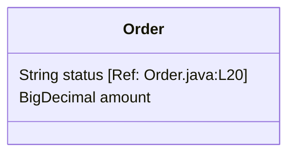

# Re: [Module Name] Technical Specification

> **Disclaimer**: 本文档由代码逆向生成。
> **Truth Level**: Snapshot (基于特定 Commit Hash 的快照)

## 1. Context & Scope
*(描述该模块在系统中的位置及其核心职责)*

## 2. The Logic (Code-Backed)
> **Rule**: Every logic claim must have a reference.

### 2.1 [Scenario A]
*   **Trigger**: `[Ref: File:Line]`
*   **Flow**:
    1.  Check condition X. `[Ref: File:Line]`
    2.  If true, execute Y. `[Ref: File:Line]`
    3.  Emit event Z. `[Ref: File:Line]`

### 2.2 [Scenario B]
...

## 3. Data Structures
*(隐含的数据库模型或内存对象)*

## 4. Corner Cases & Anomalies
*(代码中处理的特殊情况，往往是业务痛点)*

*   **Case 1**: Null pointer protection on user input. `[Ref: Service.java:L105]`
*   **Case 2**: Retry logic (3 times) when DB timeout. `[Ref: DAO.java:L50]`

## 5. Unknowns & Assumptions
*(代码中看不懂或缺失的部分)*

*   [ ] External Service X behavior is unknown (Mocked in code).
