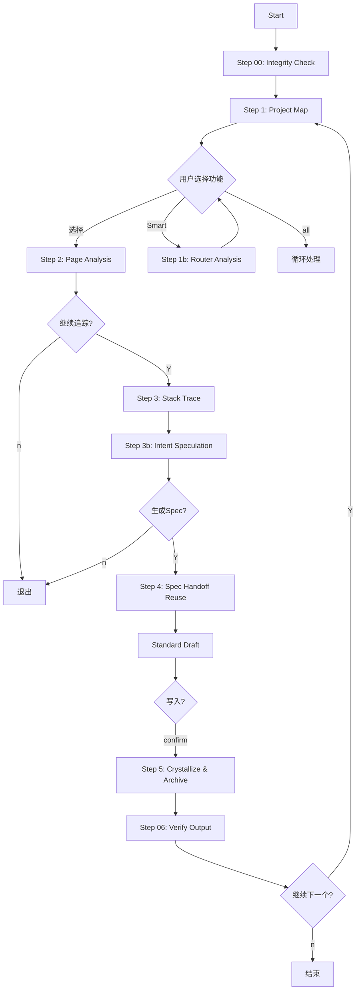

# Reverse Spec Workflow

本工作流定义了 Page-First 全栈逆向的完整流程。

## 流程概览

## Checkpoint 规则
1.  **每个 Step 结束后必须暂停**，展示阶段性产物。
2.  **等待用户确认** (`[Y/n]` 或 `[confirm/edit]`)。
3.  **用户可随时退出** (输入 `exit` 或 `n`)。

## 执行顺序

| Step | 名称 | 产出 | 参考文件 |
|------|------|------|----------|
| 00| **Integrity Check** | System Ready | `step-00-integrity-check.md` |
| 1 | Project Map | Feature Map (功能地图) | `step-01-project-map.md` |
| 1b| Router Analysis | Refined Map (路由分析) | `step-01b-router-analysis.md` |
| 2 | Page Analysis | Page Context (组件+API) | `step-02-page-analysis.md` |
| 3 | Stack Trace | Backend Context (调用链) | `step-03-stack-trace.md` |
| 3b| Intent Speculation | Intent Context (推测+Quest) | `step-03b-intent-enrichment.md` |
| 4 | Spec Handoff | Standard Unified Draft | `wrapper-04-spec-handoff.md` |
| 5 | **Crystallize** | **Archived Spec & Facts** | `../maglev-spec-crystallize/references/crystallize.workflow.md` (output_base: specs/10_reality) |
| 06| **Verify Output** | Quality Gate | `step-06-verify-output.md` |

## 异常处理
- **纯后端项目**: 跳过 Step 2，直接从 Step 3 开始。
- **纯前端项目**: Step 3 仅记录 API 契约，不追踪后端实现。
- **用户中断**: 随时可输入 `exit` 退出，已完成的 Spec 不受影响。
