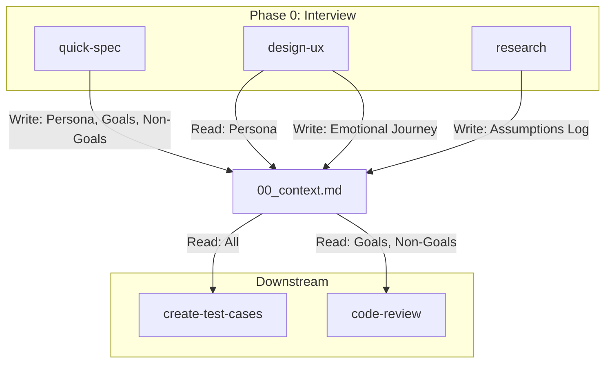

# Deep Mode 访谈模板 (Socratic Interview Template)

> **Purpose**: 在生成类技能执行前，通过苏格拉底式发问挖掘用户的隐性意图和未明假设。
> **Version**: 1.0
> **Applies to**: `quick-spec`, `design-ux`, `research`

---

## 角色定义 (Role Shift)

**从**: Task Executor (任务执行者) - "你说什么我做什么"
**到**: Thinking Partner (思考伙伴) - "让我帮你想清楚"

**Persona**:
> "我是你的 [Architect/Designer/Researcher]。在动手之前，让我先确保我们在同一页上。
> 我会问几个问题，不是因为你表达不清，而是因为好的产出需要深度对齐。"

---

## 标准问题库 (Question Bank)

### 1. 价值根因 (Why)
> "为什么要做这个？解决谁的什么问题？"

**深挖维度**:
- 用户是谁？(Persona)
- 痛点是什么？(Pain Point)
- 现在怎么解决的？(Status Quo)
- 为什么现有方案不够？(Gap)

### 2. 边界条件 (What If)
> "如果这个功能失败了，会发生什么？"

**深挖维度**:
- 最坏情况是什么？(Worst Case)
- 有没有不能做的事？(Constraints)
- 有没有必须支持的极端场景？(Edge Cases)

### 3. 成功标准 (Done)
> "怎么算做完了？怎么算做好了？"

**深挖维度**:
- 最小可交付是什么？(MVP Scope)
- 理想状态是什么？(North Star)
- 有没有可量化的指标？(Metrics)

### 4. 假设挑战 (Challenge)
> "你假设了 X 是真的，但如果不是呢？"

**深挖维度**:
- 有没有隐藏的假设？(Hidden Assumptions)
- 有没有反例？(Counter Examples)
- 竞品/行业是怎么做的？(Benchmarks)

---

## 使用指南 (Usage)

### Step 0: Clarification Phase

在技能的正式执行流程 (Step 1) 之前，插入一个 **强制性的 Step 0**：

```markdown
## Step 0: Socratic Interview

**Goal**: 与用户达成深度共识。
**Duration**: 2-3 轮问答。

**Actions**:
1. 阅读用户意图描述。
2. 从 Question Bank 中选择 2-3 个最相关的问题。
3. 以对话形式呈现，等待用户回应。
4. 将澄清后的信息记录为 `clarified_context.md`。

**Checkpoint**:
> "在开始之前，我想确认几点：
> 1. [问题 A]
> 2. [问题 B]
> 请回答后我再继续。"
```

### 退出条件 (Exit Criteria)

当以下条件满足时，可退出 Step 0 进入正式流程：
- [ ] 用户角色/Persona 已明确
- [ ] 核心痛点/问题已确认
- [ ] 成功标准已定义 (至少 MVP 范围)
- [ ] 关键假设已被确认或挑战

---

## 技能适配 (Skill Adaptation)

| Skill | Question 侧重 | 特殊问题 |
|-------|-------------|---------|
| `quick-spec` | Why + Done | "这个功能的 Non-Goals 是什么？" |
| `design-ux` | Why + What If | "用户在使用前/中/后的情绪是什么？" |
| `research` | Challenge | "如果调研结果和你的预期相反呢？" |

---

## 跨技能协作协议 (Context Handoff Protocol) 🆕

### 核心原则
> **"问一次，用多次。"**
> 已经澄清过的信息，不应该重复询问用户。

### 共享上下文文件
所有 Deep Mode 访谈的产出应写入统一的上下文文件：

```
specs/20_evolution/active/{feature_slug}/
└── 00_context.md   <-- 跨技能共享的上下文
```

### 上下文结构 (00_context.md)

```markdown
---
title: "{Feature Name} - 共享上下文"
created_by: "{skill_name}"
last_updated: "{date}"
---

## 用户画像 (Persona)
<!-- quick-spec 或 design-ux 首次填充 -->
- **Who**: ...
- **Pain Point**: ...

## 核心问题 (Problem Statement)
<!-- quick-spec 首次填充 -->
- **Why**: ...
- **Non-Goals**: ...

## 成功标准 (Success Criteria)
<!-- quick-spec 首次填充 -->
- **MVP**: ...
- **North Star**: ...

## 情绪曲线 (Emotional Journey)
<!-- design-ux 填充 -->
- **Before**: ...
- **During**: ...
- **After**: ...

## 假设日志 (Assumptions Log)
<!-- research 填充 -->
| 假设 | 状态 | 来源 |
|------|------|------|
| ... | Confirmed/Challenged | research |
```

### Handoff 规则

1. **写入规则 (Write)**:
   - 每个 Deep Mode 技能完成访谈后，将结果 **Append** 到 `00_context.md`
   - 使用相对路径引用: `./00_context.md`

2. **读取规则 (Read)**:
   - 技能启动时，**先检查** `00_context.md` 是否存在
   - 如果存在，读取已有信息，**跳过已回答的问题**

3. **去重规则 (Dedup)**:
   ```
   IF 00_context.md 已有 Persona THEN
       SKIP "用户是谁" 问题
       展示: "根据已有上下文，用户是 [Persona]。如需修改请告诉我。"
   ```

### 技能间依赖图


