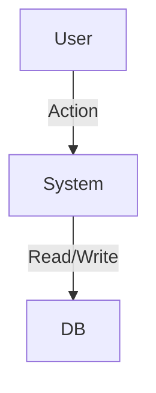
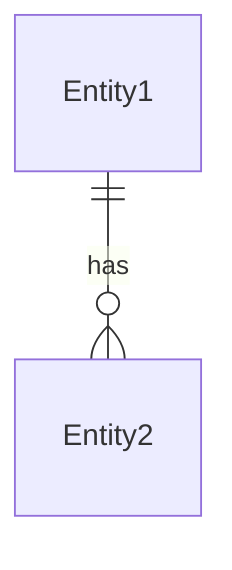

# 技术设计 (Technical Design)

> 👤 **Executive Brief (决策摘要)**
> *   **架构 (Architecture)**: {Monolith / Microservice / Serverless}
> *   **核心栈 (Core Stack)**: {Frontend Framework} + {Backend Framework} + {DB}
> *   **权衡 (Trade-off)**: {Key Technical Decision & Trade-off}

## 1. Architecture Overview (Zone 2)

### System Context (系统上下文)

### Data Model (ER Diagram)

## 2. Detailed Design (多态设计)

> **Implementation Note**:
> 根据复杂度，细节可能被拆分到 `02_design_frontend.md` 和 `02_design_backend.md`。

### API Interface (后端接口)
| Method | Path | Summary |
| :--- | :--- | :--- |
| GET | /api/resource | List resources |

### UI Structure (前端结构)
*   **Page**: {Page Name}
*   **Components**: {Comp Tree}
*   **State**: {Local/Global State}

---

🤖 Context Trace (Zone 3 - 上下文溯源)

### Design Decisions
*   **Why this stack?**: {Reasoning}
*   **Why this schema?**: {Reasoning}

