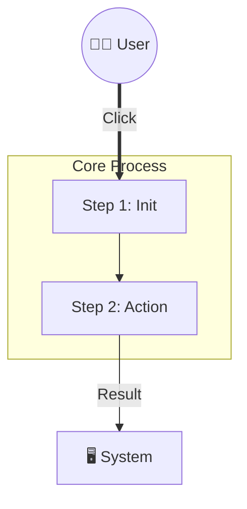
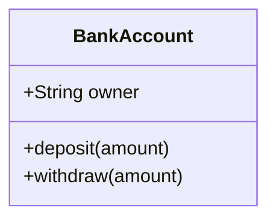

# Mermaid Expert Skill

> **Motto**: "Syntax is Law. Quotes are Safety. Structure is Clarity."

## 1. Golden Rules (黄金法则)

### Rule 1: Always Quote Labels (永远加引号)
Mermaid 对节点标签中的特殊字符 (如 `()`, `[]`, `{}`, `-`, `:`) 解析极其脆弱。
**You MUST strictly follow this pattern:**
*   ❌ Bad: `id[Function(A)]` -> Crash!
*   ✅ Good: `id["Function(A)"]` -> Safe.
*   ✅ Good: `id("Start Node")` -> Safe (but risky if internal parens exist).
*   🏆 **Best Practice**: `id["Label Content"]` (Always use double quotes inside the shape definition).

### Rule 2: Shape Preservation (形状保留)
不要因为加了引号就丢失了形状定义：
*   `[ ]`: Rectangle -> `id["Label"]`
*   `( )`: Rounded -> `id("Label")` -> Better: `id("Label")` is for shape, but if label has parens, use `id("Label(1)")` carefully. Best: `id("Label")` actually works for shape, but if you need quotes: `id(["Label"])` (Stadion) or just stick to `id["Label"]` for basic boxes to be safe.
*   **Safe Shape Strategy**:
    *   Rectangle: `id["Text"]`
    *   Round: `id("Text")` -> If text has `()`, escape them or just use `id["(Text)"]` (Rectangle) if shape not critical. Or use HTML code `#40;` `#41;`.

### Rule 3: Explicit Subgraph Termination (子图必须闭合)
**CRITICAL**: Every `subgraph` MUST have a matching `end`.
*   ❌ Bad:
    ```mermaid
    subgraph A
    A1-->A2
    subgraph B
    B1-->B2
    ```
*   ✅ Good:
    ```mermaid
    subgraph A
        direction TB
        A1-->A2
    end
    subgraph B
        direction TB
        B1-->B2
    end
    ```

### Rule 4: Define First, Connect Later (先定义，后连接)
不要在连线过程中定义节点，这会导致 ID 混乱和解析错误。
*   ❌ Bad: `Start --> Process["Process Node"] --> End(("End"))`
*   ✅ Good:
    ```mermaid
    %% 1. Definitions
    Start(("Start"))
    Process["Process Node"]
    End(("End"))
    
    %% 2. Connections
    Start --> Process
    Process --> End
    ```

### Rule 5: Avoid Inline Complexity (避免内联复杂性)
当连线标签 (`|...|`) 和节点定义混在一起时，极易报错。
*   ❌ Bad: `A -->|"Action(1)"| B["Result(2)"]` (Too many quotes/parens close together)
*   ✅ Good: Define `B` separately, then connect `A -->|"Action(1)"| B`.

## 2. Standard Templates (常用模板)

### Robust Flowchart (稳健流程图)


### Class Diagram (类图)


## 3. Self-Correction Checklist (自查清单)
Before outputting any Mermaid code, check:
1.  [ ] Are all labels with `(` or `[` or Chinese enclosed in `""`?
2.  [ ] Did I separate Node Definitions from Flow Connections?
3.  [ ] Do all `subgraph` blocks have an `end`?
4.  [ ] Are connection labels like `-->|label|` safe? (Better to use `-->|"label"|`)
5.  [ ] Are subgraph titles quoted? `subgraph Title ["Actual Title"]`
