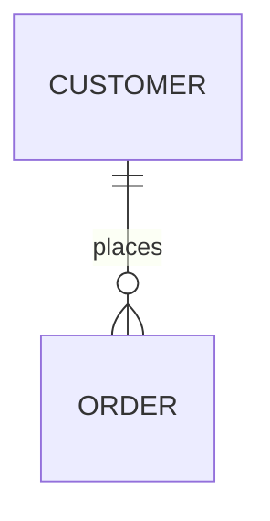
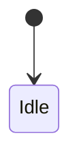

# Technical Design: [Feature Name]

> **Status**: Draft | Under Review | Approved
> **Complexity Tier**: [Atomic / Feature / Architecture]
> **Linked Spec**: [Link to Functional Spec]

## 1. Context (背景)
*   **Goal**: [简述技术目标]
*   **Scope**: [描述修改范围]

## 2. Robustness Checklist (稳健性检查 - 13 Points)

### A. 构建维 (Build Dimension) - 怎么做？
- [ ] **1. Status**: [New / Mod]
- [ ] **2. Breadcrumb**: 
    - [ ] `code_storages/repo/src/xxxx.ts` (Mod)
    - [ ] `code_storages/repo/src/yyyy.ts` (New)
- [ ] **3. Typology**: [Business Logic / Common Util / Infra]
- [ ] **4. Architecture**: 
    - Dependency Chain: `A -> B -> C`
    - Layer: [FE / BE / Data]

### B. 演进维 (Evolve Dimension) - 怎么变？
- [ ] **5. Promotion**: 
    - [ ] Is Candidate for standardized Skill? (Yes/No)
    - [ ] Is Candidate for shared Lib? (Yes/No)
- [ ] **6. Meta-Gen**: [Will generate new Rules/Workflows?]
- [ ] **7. Search Scope**: 
    - **Admissible Dirs**: `code_storages/foo`, `code_storages/bar` (Coding Agent 仅限访问此范围)
- [ ] **8. Blocker (Human Fallback)**:
    - [ ] Dependency X (无法闭环，需人工介入)

### C. 运行维 (Run Dimension) - 怎么活？
- [ ] **9. Migration**:
    - [ ] SQL: `ALTER TABLE ...`
    - [ ] Script: `migrate_v1_to_v2.py`
- [ ] **10. Rollback**:
    - [ ] Plan A: Revert Commit
    - [ ] Plan B: Restore DB Backup
- [ ] **11. Risk (Blast Radius)**: [Low / Medium / High]
- [ ] **12. Observability**:
    - [ ] Log Point: `logger.info('payment_success')`
    - [ ] Metric: `counter('pay.fail')`
- [ ] **13. Security**:
    - [ ] PII Check: [Pass]
    - [ ] Auth Check: [Role=Admin]

## 3. Detailed Design (详细设计)

### 3.1 Database Changes (ER Diagram)


### 3.2 API Contract (Interface)
```typescript
interface Request {
  // ...
}
```

### 3.3 State Machine (Core Logic)

